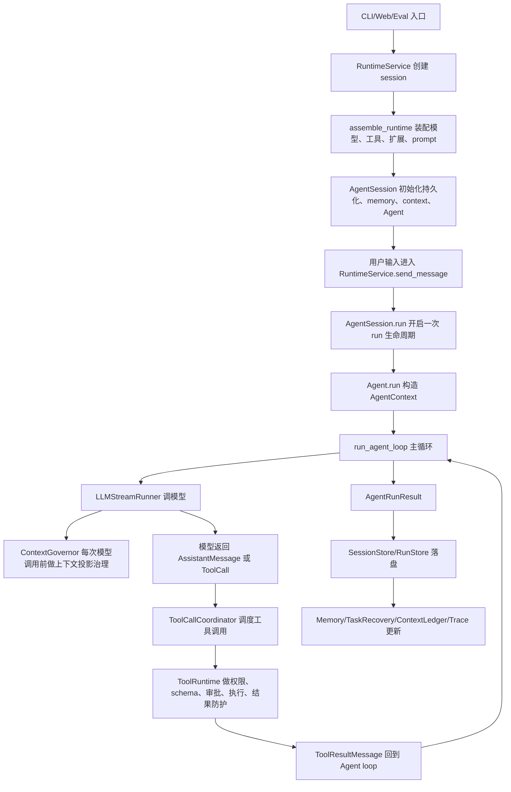

# Codepilot 运行主线导读

这份文档不是抽象架构说明，而是按一次真实运行来带你看 Codepilot：从用户启动项目、创建 session、发送消息、调用模型、执行工具、处理审批、治理上下文、记录观测数据，一直到 run 结束、任务恢复、Git 回退和会话分支。

读完以后，你应该能做到两件事：

- 知道一个请求在项目里从哪个文件进入、经过哪些层、最后在哪里收尾。
- 遇到“工具为什么被拒绝”“上下文为什么变短”“怎么恢复任务”“怎么回退文件”这类问题时，知道先看哪些文件。

Codepilot 的定位是学习型本地 Coding Agent，所以它保留了完整主链，但不会引入数据库、分布式任务队列、复杂状态机或企业级权限平台。理解它的关键是：每一层只负责自己的边界。

---

## 0. 先记住一条主线

项目的依赖方向是：

```text
protocols -> llm/tools -> core -> sessions/observability -> extensions -> runtime -> interfaces
```

但新手读代码时，不建议从最底层 `protocols/` 开始逐个文件看。更好的方式是沿着“运行主线”读：



这条链路里的关键文件如下：

| 阶段 | 先看文件 | 重点函数或类 |
|---|---|---|
| 命令行入口 | `src/codepilot/interfaces/cli/main.py` | `main()`、`_run_from_args()` |
| 运行模式分发 | `src/codepilot/interfaces/cli/runner.py` | `run()`、`run_interactive()`、`run_print()` |
| Runtime 门面 | `src/codepilot/runtime/service.py` | `RuntimeService.create_session()`、`send_message()` |
| Runtime 装配 | `src/codepilot/runtime/assembly.py` | `assemble_runtime()` |
| 工具装配 | `src/codepilot/runtime/bootstrap/tool_assembler.py` | `assemble_tools()` |
| Session 主类 | `src/codepilot/sessions/session.py` | `AgentSession.__init__()`、`run()` |
| Agent 外观 | `src/codepilot/core/agent.py` | `Agent.run()`、`_start_run()` |
| Agent 主循环 | `src/codepilot/core/agent_loop.py` | `run_agent_loop()`、`_run_loop()` |
| 模型调用 | `src/codepilot/core/llm_runner.py` | `LLMStreamRunner.stream_assistant_response()` |
| 上下文治理 | `src/codepilot/sessions/context/governor.py` | `ContextGovernor.prepare()` |
| 工具调度 | `src/codepilot/core/tool_coordinator.py` | `ToolCallCoordinator.execute_batch()` |
| 工具安全边界 | `src/codepilot/tools/execution.py` | `ToolRuntime.execute()`、`execute_approved()` |
| Run 落盘 | `src/codepilot/sessions/persistence/run_store.py` | `RunStore.append_run_result()` |

---

## 1. 项目启动：用户从接口层进入

最常见入口是 CLI。`pyproject.toml` 会把命令指向 `codepilot.interfaces.cli.main:main`。实际代码在：

| 文件 | 作用 |
|---|---|
| `src/codepilot/interfaces/cli/main.py` | 解析参数，处理 `config` / `rpc` 子命令，创建 `RuntimeService` |
| `src/codepilot/interfaces/cli/runner.py` | 分发 `print`、`interactive`、`rpc` 三种运行模式 |
| `src/codepilot/interfaces/cli/shell.py` | 交互式输入、历史、补全 |
| `src/codepilot/interfaces/cli/renderer.py` | 把 Agent 事件渲染到终端 |
| `src/codepilot/interfaces/cli/commands.py` | 处理 `/help`、`/context`、`/rollback`、`/memory` 等斜杠命令 |
| `src/codepilot/interfaces/web/api.py` | Web 后端入口，和 CLI 一样委托给 `RuntimeService` |

CLI 启动的关键路径是：

```text
main.py:main()
  -> main.py:_run_from_args()
    -> RuntimeService()
    -> RuntimeService.create_session(options)
    -> runner.py:run(RunOptions)
```

这里要注意一个边界：`interfaces/` 只做输入输出适配。它不会直接调用模型、不会直接执行工具、也不会自己改 session 内部状态。所有核心动作都通过 `RuntimeService` 完成。

---

## 2. 创建 Session：Runtime 先把项目装配起来

用户启动后，`RuntimeService.create_session()` 会调用 `assemble_runtime()`。这一步不是“开始推理”，而是把本次会话运行需要的东西组装好。

| 文件 | 作用 |
|---|---|
| `src/codepilot/runtime/service.py` | 保存 session 注册表、assembly 注册表、active run、pending approvals |
| `src/codepilot/runtime/assembly.py` | Runtime 组装主入口 |
| `src/codepilot/runtime/contracts.py` | `CreateAgentSessionOptions`、`AgentSessionOptions`、`RuntimeAssembly` 等应用层契约 |
| `src/codepilot/runtime/bootstrap/config.py` | 合并 CLI、会话、工作区、默认配置 |
| `src/codepilot/runtime/bootstrap/model_resolver.py` | 解析 provider/model/API key 来源 |
| `src/codepilot/runtime/bootstrap/resources.py` | 读取 `.codepilot` 下的工作区资源 |
| `src/codepilot/runtime/bootstrap/tool_assembler.py` | 组装内置工具、扩展工具、MCP 工具 |
| `src/codepilot/runtime/bootstrap/context.py` | 构建仓库 bootstrap 信息 |
| `src/codepilot/runtime/bootstrap/prompt.py` | 组合系统提示词 |
| `src/codepilot/runtime/bootstrap/hook_pipeline.py` | 合并生命周期 hook 和 tool hook |

`assemble_runtime()` 的核心步骤是：

```text
load_runtime_inputs()
  -> resolve_model()
  -> resolve_runtime_config()
  -> assemble_tools()
  -> build_runtime_context()
  -> build_runtime_system_prompt()
  -> compose hooks
  -> AgentSessionOptions
  -> AgentSession
  -> RuntimeAssembly
```

`RuntimeAssembly` 很重要，它保存了“本次 session 实际运行时配置”，包括：

| 字段 | 含义 |
|---|---|
| `session_options` | 创建 `AgentSession` 时使用的最终选项 |
| `profile` | 解析后的模型、权限模式、任务模式、配置来源 |
| `repository` | 工作区路径、仓库 bootstrap 信息 |
| `capabilities` | 当前有效工具和命令目录 |
| `tool_runtime` | 统一工具执行安全边界 |
| `diagnostics` | 工具冲突、扩展加载等诊断信息 |

新手可以把 runtime 理解成“装配层”：它不负责 Agent 怎么思考，但负责把模型、工具、扩展、会话存储和配置接好。

---

## 3. 工具注册：模型能看到哪些工具在启动时决定

工具不是模型临时自己创造的。Codepilot 在 runtime 装配阶段就确定当前 session 的有效工具目录。

核心文件：

| 文件 | 作用 |
|---|---|
| `src/codepilot/runtime/bootstrap/tool_assembler.py` | 工具来源合并、冲突诊断、read-only 过滤、创建 `ToolRuntime` |
| `src/codepilot/tools/builtins/__init__.py` | 创建内置工具 |
| `src/codepilot/tools/metadata.py` | 内置工具和外部工具 metadata |
| `src/codepilot/tools/registry.py` | 工具注册表 |
| `src/codepilot/tools/execution.py` | `ToolRuntime.as_agent_tools()` 把注册表包装成 runtime-managed 工具 |
| `src/codepilot/extensions/loader.py` | 加载 Python 扩展工具 |
| `src/codepilot/extensions/skills.py` | 加载 Markdown skill 命令和 prompt |
| `src/codepilot/extensions/mcp/bridge.py` | MCP 工具代理 |

`assemble_tools()` 的工具来源顺序是：

```text
内置工具 -> 调用方传入工具 -> Python 扩展工具 -> MCP 代理工具
```

但内置工具名是保留名。扩展或 MCP 不能覆盖 `read`、`edit`、`bash` 这类内置工具，否则会产生诊断并跳过。

read-only 模式下，`assemble_tools()` 会过滤掉非只读工具，并且同步更新：

- `ToolRegistry`：实际可执行工具。
- `registered_tools`：runtime 能力目录。
- `AgentContext.tools`：模型可见工具。

这保证 UI、模型和实际执行边界看到的是同一套有效工具。

更详细的工具设计可以继续读 `docs/design/4tool-design.md`。

---

## 4. Session 初始化：创建事实源、记忆、上下文治理入口

`AgentSession` 是会话层主类。它不负责解析 CLI，也不负责 provider API 细节；它负责一个 session 的事实源和 run 生命周期。

| 文件 | 作用 |
|---|---|
| `src/codepilot/sessions/session.py` | `AgentSession` 主类 |
| `src/codepilot/sessions/layout.py` | 统一定义 `.codepilot` 下的 session/run/memory/context 路径 |
| `src/codepilot/sessions/persistence/store.py` | `SessionStore`，管理 `session.json`、`messages.jsonl`、`events.jsonl` |
| `src/codepilot/sessions/persistence/run_store.py` | `RunStore`，管理每个 run 的 `run.json`、`events.jsonl`、`trace.json` |
| `src/codepilot/sessions/memory/store.py` | session/project memory 存储 |
| `src/codepilot/sessions/memory/retriever.py` | 每次上下文准备时召回记忆 |
| `src/codepilot/sessions/memory/writer.py` | run 收尾时沉淀记忆 |
| `src/codepilot/sessions/history/task_recovery.py` | 保存当前任务恢复投影 |
| `src/codepilot/sessions/context/governor.py` | 每次模型调用前的上下文投影治理入口 |
| `src/codepilot/core/agent.py` | 被 session 持有的核心 Agent 实例 |

会话文件主要落在：

```text
.codepilot/
  sessions/<session_id>/
    session.json
    messages.jsonl
    events.jsonl
    memory.json
    context_ledger.jsonl
    artifacts/tool_outputs/*.txt
  runs/<run_id>/
    run.json
    events.jsonl
    trace.json
  memory/project.jsonl
  MEMORY.md
```

`AgentSession.__init__()` 做这些事：

1. 创建或恢复 `SessionStore`。
2. 初始化 `MemoryStore`、`MemoryWriter`、`MemoryRetriever`。
3. 初始化 `TaskRecoveryStore`。
4. 调用 `_build_context_preparer()` 创建 `ContextGovernor.prepare`。
5. 从 `messages.jsonl` 读取历史消息。
6. 创建 `AgentOptions` 和 `Agent`。
7. 订阅 Agent 事件，把事件和消息落盘。

这里的关键是：session 是事实源，Agent 是执行引擎。Agent 运行过程中产生的消息、事件、工具结果，最终都通过 session 写回 `.codepilot`。

---

## 5. 用户发送消息：Runtime 创建 active run 并转交 Session

当用户输入普通文本时，CLI 会走：

```text
runner.py:_render_prompt_run()
  -> RuntimeService.send_message(session_id, UserInput)
```

核心文件：

| 文件 | 作用 |
|---|---|
| `src/codepilot/interfaces/cli/runner.py` | 普通文本转给 `RuntimeService.send_message()` |
| `src/codepilot/runtime/service.py` | 校验 session、空输入、busy 状态，创建 active run |
| `src/codepilot/runtime/execution/runs.py` | `ActiveRunTracker`，同一 session 同时只允许一个活跃 run |
| `src/codepilot/sessions/session.py` | `AgentSession.run()` 真正启动 session 侧生命周期 |

`RuntimeService.send_message()` 不是直接返回最终文本，而是一个异步事件流：

```text
RuntimeService.send_message()
  -> _validate_request()
  -> _stream_active_session_call()
  -> _stream_session_events()
  -> AgentSession.run()
```

`_stream_session_events()` 会订阅 session 的事件，把 `message_start`、`message_update`、`tool_execution_start`、`tool_execution_end`、`context_prepared`、`agent_end` 等事件推给 CLI/Web。

这就是为什么 CLI 能实时看到模型输出和工具执行进度。

---

## 6. Run 开始前：Session 做生命周期准备

一次 run 真正开始前，`AgentSession.run()` 会先进入 `_start_run_lifecycle()`。

核心文件：

| 文件 | 作用 |
|---|---|
| `src/codepilot/sessions/session.py` | `_start_run_lifecycle()`、`run()`、`continue_run()` |
| `src/codepilot/runtime/bootstrap/hook_pipeline.py` | 组合 before/after prompt hook |
| `src/codepilot/sessions/history/git_rollback.py` | `capture_git_baseline()` 捕获 Git clean-worktree 基线 |
| `src/codepilot/sessions/history/task_recovery.py` | `TaskRecoveryStore.begin_task()` 写入任务恢复投影 |
| `src/codepilot/sessions/persistence/run_store.py` | `evaluate_freshness()` 检查上次 run 追踪文件是否过期 |
| `src/codepilot/sessions/context/freshness.py` | 构造 stale context steering message |

这一阶段做几件事：

1. 捕获 Git 回退基线：只有 run 开始前工作区是 clean，后续才可能自动回退。
2. 执行 `before_prompt_hooks`：扩展或调用方可以在 prompt 前做准备。
3. 如果启用 memory，把用户提示里适合持久化的内容准入到 memory 流程。
4. 写入 task recovery 初始投影，记录当前目标。
5. 把 active task recovery projection 注入 Agent。
6. 检查 context freshness：如果上次 run 追踪的文件被外部改动，注入 steering message 提醒 Agent 重读。

这里不要把“上下文投影治理”和“run 开始前准备”混在一起。`_start_run_lifecycle()` 只是准备事实和提示；真正决定本次发给模型哪些消息，是下一步 `ContextGovernor.prepare()`。

---

## 7. Agent 开始运行：core 层只负责推理循环

`AgentSession.run()` 会调用 `Agent.run()`，再进入 `Agent._start_run()`。

核心文件：

| 文件 | 作用 |
|---|---|
| `src/codepilot/core/agent.py` | `Agent` 外观，持有模型、工具、消息状态 |
| `src/codepilot/core/types.py` | `AgentContext`、`AgentLoopConfig` 等 core 层类型 |
| `src/codepilot/core/agent_loop.py` | Agent 主循环 |
| `src/codepilot/core/run_state.py` | run 计数器和工具结果汇总 |
| `src/codepilot/core/run_decisions.py` | 是否重试、是否执行工具、是否停止等纯决策 |

`Agent._start_run()` 做三件核心事：

1. 构造 `AgentLoopConfig`：模型、工具执行模式、hook、重试参数、任务控制参数。
2. 构造 `AgentContext`：system prompt、历史消息、工具、task recovery projection。
3. 根据是新任务还是继续任务，调用：
   - `run_agent_loop()`
   - `run_agent_loop_continue()`

core 层的边界是：它编排模型和工具，但不负责持久化、不解析扩展、不自己决定本地权限策略。

---

## 8. 每次模型调用前：上下文投影治理

模型调用不是直接拿完整历史。`LLMStreamRunner.stream_assistant_response()` 每次调模型前，都会调用 `prepare_context`，也就是 `ContextGovernor.prepare()`。

核心文件：

| 文件 | 作用 |
|---|---|
| `src/codepilot/core/llm_runner.py` | 模型调用前执行 `prepare_context`，并发出 `context_prepared` 事件 |
| `src/codepilot/sessions/session.py` | `_build_context_preparer()` 把 `ContextGovernor.prepare` 绑定进 Agent |
| `src/codepilot/sessions/context/governor.py` | 上下文治理主入口 |
| `src/codepilot/sessions/context/snapshot.py` | 汇总仓库状态、工具结果、artifact、checkpoint |
| `src/codepilot/sessions/context/repository_tracker.py` | 计算仓库 fingerprint 和 delta |
| `src/codepilot/sessions/context/policy.py` | 计算 `normal/tight/critical` 压力 |
| `src/codepilot/sessions/context/projector.py` | 组装 system prompt、裁剪 messages、修复 tool call/result 配对 |
| `src/codepilot/sessions/context/ledger.py` | 工具大输出 artifact 化，写入 context ledger |
| `src/codepilot/sessions/context/checkpoint.py` | critical 压力下创建 checkpoint |
| `src/codepilot/llm/overflow.py` | 估算 token 压力 |

这一步可以理解为“上下文投影治理”，不要简单理解成手动压缩。它会：

1. 汇总仓库快照、工具结果、active files、verification evidence、artifact refs。
2. 召回 memory。
3. 估算当前 messages、system prompt、工具输出 token。
4. 判断压力级别：`normal`、`tight`、`critical`。
5. 按压力组装结构化上下文区块。
6. 在 tight/critical 下把长工具输出替换为 artifact 摘要。
7. critical 时写 checkpoint。
8. 生成 `ContextReport`，并写入 `context_ledger.jsonl`。

`LLMStreamRunner` 拿到治理后的 `PreparedAgentContext` 后，才会构造 provider 请求：

```text
Context(
  system_prompt=prepared.system_prompt,
  messages=convert_to_llm(prepared.messages),
  tools=[tool.to_spec() for tool in prepared.tools]
)
```

进一步细节看 `docs/design/2context-design.md`。

---

## 9. 调用模型：LLM 层只负责 provider 适配

模型调用由 `LLMStreamRunner` 发起，最终分发到 `llm` provider。

| 文件 | 作用 |
|---|---|
| `src/codepilot/core/llm_runner.py` | 上下文准备、能力校验、API key 获取、流式响应处理 |
| `src/codepilot/core/message_conversion.py` | 把内部消息转为 provider 可消费的协议消息 |
| `src/codepilot/llm/api_registry.py` | 根据 `model.api` 分发 provider |
| `src/codepilot/llm/models.py` | 内置模型目录 |
| `src/codepilot/llm/providers/register_builtins.py` | 注册内置 provider |
| `src/codepilot/llm/providers/anthropic.py` | Anthropic Messages API 适配 |
| `src/codepilot/llm/providers/openai_compatible.py` | OpenAI-compatible Chat Completions 适配 |
| `src/codepilot/llm/event_stream.py` | 标准化助手消息事件流 |

模型返回的结果会变成 `AssistantMessage`。如果消息里包含 `ToolCall`，主循环会进入工具执行阶段；如果没有工具调用，后面会进入任务完成检查和 run 收尾。

---

## 10. Agent 主循环：模型、工具、任务控制不断交替

核心循环在 `src/codepilot/core/agent_loop.py`。

主循环大致是：

```text
run_agent_loop()
  -> 创建 RunState 和 AgentEventEmitter
  -> 追加用户消息
  -> _run_safely()
  -> _run_loop()
      -> LLMStreamRunner.stream_assistant_response()
      -> 提取 ToolCall
      -> decide_tool_execution_gate()
      -> ToolCallCoordinator.execute_batch()
      -> TaskController.after_tool_results()
      -> decide_post_tool_run()
      -> completion check
      -> _finish_run()
```

相关文件：

| 文件 | 作用 |
|---|---|
| `src/codepilot/core/agent_loop.py` | 主循环和停止条件 |
| `src/codepilot/core/run_decisions.py` | 工具是否继续、模型是否重试、run 是否停止 |
| `src/codepilot/core/run_state.py` | 统计模型调用、工具调用、受影响文件、验证结果 |
| `src/codepilot/core/events.py` | `AgentEventEmitter`，统一补充 runId/sessionId/序号 |
| `src/codepilot/core/task_control/controller.py` | 任务计划、步骤更新、完成检查 |
| `src/codepilot/core/task_control/rules.py` | 任务控制规则 |
| `src/codepilot/core/task_control/discovery.py` | 任务发现和计划输入 |
| `src/codepilot/core/task_control/tools.py` | 任务控制相关工具识别 |

主循环的停止原因包括：

| stop reason | 常见含义 |
|---|---|
| `final_answer` | 模型给出最终回答 |
| `approval_required` | 工具需要用户审批，run 暂停 |
| `max_iterations` | 工具循环次数达到上限 |
| `repeated_tool_call` | 重复工具调用过多 |
| `task_incomplete` | 任务控制器认为还没满足完成条件 |
| `task_blocked` | 需要用户补充信息或外部动作 |
| `model_error` | LLM 调用失败 |
| `internal_error` | 内部异常 |
| `aborted` | 用户取消 |

---

## 11. 工具调用：core 负责调度，tools 负责安全边界

当模型返回 `ToolCall` 后，`ToolCallCoordinator` 会接管。

| 文件 | 作用 |
|---|---|
| `src/codepilot/core/tool_coordinator.py` | 工具批次准备、并行/串行调度、hook、事件、结果消息 |
| `src/codepilot/tools/execution.py` | 工具执行安全管线 |
| `src/codepilot/tools/policy.py` | 权限决策 |
| `src/codepilot/tools/argument_schema.py` | JSON Schema 参数校验 |
| `src/codepilot/tools/approval.py` | 审批 provider 协议和默认延迟审批 |
| `src/codepilot/tools/result_safety.py` | secret/PII/prompt injection/output trust 防护 |
| `src/codepilot/tools/workspace_safety.py` | 工作区路径边界和文件状态 |
| `src/codepilot/tools/shell_safety.py` | shell 命令分类、环境过滤、输出截断 |
| `src/codepilot/tools/builtins/files.py` | `ls`、`read`、`write`、`edit` |
| `src/codepilot/tools/builtins/search.py` | `grep`、`find` |
| `src/codepilot/tools/builtins/shell.py` | `bash` |
| `src/codepilot/tools/builtins/workspace_status.py` | `workspace_status` |

调用链是：

```text
ToolCallCoordinator.execute_batch()
  -> _prepare()
      -> 工具是否在 AgentContext.tools 中
      -> 是否 runtime_managed
      -> before_tool_call hook
  -> _execute_prepared()
      -> AgentTool.execute()
      -> ToolRuntime.execute()
  -> _finalize()
      -> after_tool_call hook
      -> tool_execution_end event
      -> ToolResultMessage
```

`ToolRuntime.execute()` 的顺序是：

```text
ToolRegistry 查找工具
  -> PermissionPolicy 权限硬拦截
  -> SchemaValidator 参数校验
  -> ApprovalProvider 审批
  -> 真实工具 execute
  -> 写入 permission/duration metadata
  -> ToolResultGuard 结果防护
  -> 返回 AgentToolResult
```

这里有一个重要边界：`ToolCallCoordinator` 只判断“这次模型请求的工具是否在当前上下文可见，以及 hook 是否拦截”。真正的权限、schema、审批、结果防护都在 `ToolRuntime`。具体文件路径和 shell 风险则由内置工具自己处理。

---

## 12. 权限审批：等待用户后，仍然回到 ToolRuntime 主链

如果 `PermissionPolicy` 判断某个工具需要审批，`ToolRuntime` 会返回 `status="approval_required"` 的工具结果。此时 run 会以 `waiting_approval` 状态停止。

核心文件：

| 文件 | 作用 |
|---|---|
| `src/codepilot/tools/policy.py` | 返回 `allow`、`deny`、`approval_required` |
| `src/codepilot/tools/approval.py` | `ApprovalProvider` 和 `DeferredApprovalProvider` |
| `src/codepilot/runtime/execution/approval.py` | `PendingApproval`、审批结果规范化、pending approval 提取 |
| `src/codepilot/runtime/service.py` | pending approval 表、审批入口、审批后继续 run |
| `src/codepilot/interfaces/cli/approval.py` | CLI 交互式审批 provider |
| `src/codepilot/interfaces/web/api.py` | Web 审批 API |

审批暂停的路径是：

```text
ToolRuntime.execute()
  -> approval_required ToolResult
  -> agent_loop 返回 waiting_approval
  -> RuntimeService._record_pending_approvals()
  -> _pending_approvals[approval_id] = PendingApproval
```

用户批准后的路径是：

```text
RuntimeService.approve_tool_call(approval_id, "approve")
  -> _resume_after_tool_approval()
  -> _execute_approved_tool()
  -> assembly.tool_runtime.execute_approved()
  -> session.execute_approved_tool_call()
  -> session.continue_after_tool_approval()
```

这说明审批不是“绕过安全检查”。批准后的工具调用仍会经过：

- `ToolRuntime.execute_approved()`
- schema 校验
- 权限记录
- 真实工具执行
- `ToolResultGuard`
- tool 事件
- session 消息替换
- run 继续执行

如果用户拒绝，`runtime/execution/approval.py` 会构造 `status="denied"` 的 `ToolResultMessage`，替换原来的 pending approval 消息，然后继续让 Agent 看到“用户拒绝了这个工具动作”的结果。

---

## 13. 工具结果回流：结果不是文本，而是结构化证据

工具执行结束后，`ToolCallCoordinator` 会把 `AgentToolResult` 转成 `ToolResultMessage`。这个消息会被多个模块继续消费。

| 消费者 | 文件 | 用途 |
|---|---|---|
| Agent loop | `src/codepilot/core/agent_loop.py` | 把工具结果追加进消息列表，决定下一轮模型调用 |
| Task controller | `src/codepilot/core/task_control/controller.py` | 根据工具状态、验证结果、受影响文件更新任务进度 |
| SessionStore | `src/codepilot/sessions/persistence/store.py` | `message_end` 时写入 `messages.jsonl` |
| RunStore | `src/codepilot/sessions/persistence/run_store.py` | 统计 tool calls、affected paths、workspace changed |
| ContextGovernor | `src/codepilot/sessions/context/governor.py` | 下一次模型调用前把工具结果变成 evidence 或 artifact |
| MemoryWriter | `src/codepilot/sessions/memory/writer.py` | run 收尾时沉淀经验或修正 |
| Observability | `src/codepilot/observability/events.py`、`recorder.py` | 归一化事件、写入 trace/audit |
| CLI/Web | `src/codepilot/interfaces/cli/renderer.py`、`interfaces/web/event_adapter.py` | 展示工具开始、结束、审批、错误 |

工具结果里的关键字段包括：

| 字段 | 作用 |
|---|---|
| `status` | `success/error/denied/approval_required/cancelled` |
| `error_code` | 稳定错误分类 |
| `approved`、`approval_id` | 审批状态 |
| `affected_paths` | 这次工具影响了哪些文件 |
| `workspace_changed` | 工作区是否发生变化 |
| `verification` | 验证命令结构化结果 |
| `metadata.permission_decision` | 权限决策证据 |
| `metadata.result_guard` | 输出防护证据 |
| `metadata.duration_ms` | 工具耗时 |

这也是为什么工具结果不能只是一段 stdout 文本：后面的任务控制、上下文治理、回退、观测都依赖结构化字段。

---

## 14. 事件和观测：运行过程如何被记录

Agent 运行时会不断发事件。事件先从 core 发出，再由 session 监听落盘，最后被 CLI/Web 渲染或被 RunStore 汇总。

核心文件：

| 文件 | 作用 |
|---|---|
| `src/codepilot/core/events.py` | `AgentEventEmitter` 补充 run/session/sequence 信息 |
| `src/codepilot/sessions/session.py` | `_on_agent_event()` 订阅 Agent 事件并写入 store |
| `src/codepilot/sessions/persistence/store.py` | `append_event()` 同时写 session event 和 run event |
| `src/codepilot/sessions/persistence/run_store.py` | `append_event()` 更新 run 状态，`append_run_result()` 写最终结果 |
| `src/codepilot/observability/recorder.py` | JSONL 事件读写 |
| `src/codepilot/observability/events.py` | 事件归一化 |
| `src/codepilot/observability/redact.py` | 审计产物脱敏 |
| `src/codepilot/observability/trace.py` | 构造 run trace |
| `src/codepilot/observability/summary.py` | 构造人类可读 run report |

常见事件包括：

```text
agent_start
turn_start
context_prepared
message_start
message_update
message_end
tool_execution_start
tool_execution_update
tool_execution_end
task_plan_created
task_step_updated
task_decision
completion_checked
agent_end
error
```

`SessionStore.append_event()` 会把事件写入：

- `.codepilot/sessions/<session_id>/events.jsonl`
- `.codepilot/runs/<run_id>/events.jsonl`

`RunStore.append_run_result()` 会写：

- `.codepilot/runs/<run_id>/run.json`
- `.codepilot/runs/<run_id>/trace.json`

所以排查一次运行时，可以先看 `runs/<run_id>/run.json`，再看同目录的 `events.jsonl` 和 `trace.json`。

---

## 15. Run 收尾：落盘、任务恢复、记忆、上下文 ledger

`agent_loop` 返回 `AgentRunResult` 后，控制权回到 `AgentSession._complete_run_lifecycle()`。

核心文件：

| 文件 | 作用 |
|---|---|
| `src/codepilot/sessions/session.py` | `_complete_run_lifecycle()` |
| `src/codepilot/sessions/persistence/store.py` | `append_run_result()` |
| `src/codepilot/sessions/persistence/run_store.py` | 写 run 结果、tracked files、trace |
| `src/codepilot/sessions/history/git_rollback.py` | `build_rollback_metadata()` |
| `src/codepilot/sessions/history/task_recovery.py` | `update_from_result()` |
| `src/codepilot/sessions/memory/writer.py` | `finalize_run()` |
| `src/codepilot/sessions/context/governor.py` | `finalize_run()` 扩展点 |
| `src/codepilot/runtime/bootstrap/hook_pipeline.py` | after prompt hook |

收尾顺序是：

```text
SessionStore.append_run_result(result)
  -> 写 run.json / trace.json
_write_rollback_metadata(result, baseline)
  -> 写 rollback 字段
_finalize_task_recovery(result)
  -> 更新 session.json 里的 task_recovery
_finalize_memory(result)
  -> 沉淀结构化记忆
context_governor.finalize_run(result)
  -> 当前是上下文治理扩展点
after_prompt_hooks
```

这一步完成后，本次 run 才算真正结束。CLI 最后渲染 assistant final message，但文件系统里已经有完整的 session/run 证据。

---

## 16. Git 回退：只回退安全子集

Codepilot 的 Git 回退不是全量事务系统，而是一个可解释的学习型安全子集。

核心文件：

| 文件 | 作用 |
|---|---|
| `src/codepilot/sessions/history/git_rollback.py` | 捕获基线、生成回退计划、执行回退 |
| `src/codepilot/sessions/session.py` | `preview_last_run_rollback()`、`revert_last_run()`、`revert_run()` |
| `src/codepilot/interfaces/cli/commands.py` | `/rollback` 和 `/rollback apply` |
| `src/codepilot/sessions/persistence/run_store.py` | `run.json` 中保存 rollback metadata 和 tracked files |
| `src/codepilot/tools/workspace_safety.py` | 文件状态快照 `file_state_for_path()` |

运行前：

```text
AgentSession._start_run_lifecycle()
  -> capture_git_baseline()
```

运行后：

```text
AgentSession._complete_run_lifecycle()
  -> _write_rollback_metadata()
  -> build_rollback_metadata()
  -> RunStore.write_rollback_metadata()
```

用户预览：

```text
/rollback
  -> AgentSession.preview_last_run_rollback()
  -> plan_run_rollback()
```

用户执行：

```text
/rollback apply
  -> AgentSession.revert_last_run()
  -> revert_run_changes()
  -> session event: run_reverted
```

自动回退只在这些条件下工作：

| 条件 | 原因 |
|---|---|
| run 开始前 Git 工作区必须 clean | 避免误删用户已有改动 |
| 只处理该 run 的 `affected_paths` | 避免扩大回退范围 |
| `.codepilot/` 内部文件跳过 | 不回退运行证据本身 |
| 文件在 run 结束后又被改动则拒绝 | 避免覆盖用户后续修改 |
| staged affected path 会 block | 避免破坏用户暂存区 |

所以 `/rollback` 先给计划，`/rollback apply` 才修改文件。

---

## 17. 会话恢复、分支和清空

Codepilot 的 session 历史是树形 transcript，不只是线性聊天记录。

核心文件：

| 文件 | 作用 |
|---|---|
| `src/codepilot/sessions/persistence/store.py` | `messages.jsonl` 中每条 message entry 有 `id` 和 `parent_id` |
| `src/codepilot/sessions/history/branching.py` | fork、switch、fresh session |
| `src/codepilot/sessions/session.py` | `fork_session()`、`switch_to_entry()`、`rebind_store()` |
| `src/codepilot/runtime/service.py` | `fork_session()`、`clear_session()`、`switch_entry()` |
| `src/codepilot/interfaces/cli/commands.py` | `/tree`、`/fork`、`/new`、`/switch`、`/clear` |

常见命令对应关系：

| 命令 | 做什么 | 关键路径 |
|---|---|---|
| `/tree` | 展示当前 session 的消息树 | `SessionStore.get_session_tree()` |
| `/fork <entry_id>` | 从某个消息节点分叉新 session | `RuntimeService.fork_session()` -> `branch_fork_session()` |
| `/new` | 从当前 leaf 分叉新 session | `commands.py` -> `RuntimeService.fork_session()` |
| `/switch <entry_id>` | 切换当前 session leaf | `RuntimeService.switch_entry()` -> `branch_switch_to_entry()` |
| `/clear` | 创建一个 fresh session | `RuntimeService.clear_session()` -> `create_fresh_session()` |

这里的“清空上下文”不是删除所有事实，而是创建一个新的 session 分支，让后续消息从新上下文开始。旧 session 仍在 `.codepilot/sessions/` 中。

---

## 18. 扩展接入：扩展提供能力，但不接管安全边界

扩展层保留在 `extensions/`，职责是把外部能力归一化成 Codepilot 能理解的工具、命令、prompt 或 hook。

| 文件 | 作用 |
|---|---|
| `src/codepilot/extensions/api.py` | 给 Python 扩展的 `ExtensionAPI` |
| `src/codepilot/extensions/loader.py` | 加载 `.codepilot/extensions/*.py` |
| `src/codepilot/extensions/skills.py` | 加载 `.codepilot/skills/*.md` |
| `src/codepilot/extensions/types.py` | `LoadedExtensions` 标准能力集合 |
| `src/codepilot/extensions/mcp/bridge.py` | MCP tool config 解析、代理工具创建 |
| `src/codepilot/runtime/bootstrap/tool_assembler.py` | 把扩展工具和 MCP 工具接入 `ToolRuntime` |
| `src/codepilot/runtime/bootstrap/hook_pipeline.py` | 把扩展 hook 合并到主链 |

边界要记清楚：

- `extensions/` 负责加载和归一化外部能力。
- `tools/` 负责权限、schema、审批、执行后防护。
- `runtime/` 负责把扩展能力装进当前 session。
- `core/` 只看到已经装配好的工具和 hook。

这也是为什么 MCP 具体 server/tool 风险解析留在 `extensions/mcp`，但 MCP 工具执行仍要进入 `ToolRuntime`。

---

## 19. 斜杠命令：不经过模型，直接调用 Runtime/Session

交互模式里，以 `/` 开头的是命令，不会发给模型。

核心文件：

| 文件 | 作用 |
|---|---|
| `src/codepilot/interfaces/cli/runner.py` | 检测 `/` 开头输入，调用 `handle_cli_command()` |
| `src/codepilot/interfaces/cli/commands.py` | 内置命令和扩展命令处理 |
| `src/codepilot/sessions/types.py` | `RegisteredCommand`、`SessionCommandContext` |
| `src/codepilot/extensions/api.py` | 扩展注册命令 |

几个重要命令：

| 命令 | 查看文件 |
|---|---|
| `/status` | `RuntimeService.get_session_status()` |
| `/context` | `AgentSession.latest_context_report` |
| `/memory` | `sessions/memory/*` |
| `/rollback` | `sessions/history/git_rollback.py` |
| `/tools` | `session.agent.state.tools` |
| `/mode` | `RuntimeService.set_task_mode()` |

当前项目没有手动压缩命令。上下文治理发生在每次模型调用前，由 `ContextGovernor.prepare()` 自动执行。

---

## 20. 新手按目标读代码

如果你想系统读项目，推荐顺序是：

```text
interfaces/cli/main.py
  -> runtime/service.py
  -> runtime/assembly.py
  -> runtime/bootstrap/tool_assembler.py
  -> sessions/session.py
  -> core/agent.py
  -> core/agent_loop.py
  -> core/llm_runner.py
  -> core/tool_coordinator.py
  -> tools/execution.py
  -> sessions/context/governor.py
  -> sessions/persistence/store.py
  -> sessions/persistence/run_store.py
```

如果你带着问题读，可以这样定位：

| 我想知道 | 先看 |
|---|---|
| CLI 怎么启动 | `src/codepilot/interfaces/cli/main.py` |
| 为什么有三种运行模式 | `src/codepilot/interfaces/cli/runner.py` |
| session 怎么创建和恢复 | `src/codepilot/runtime/service.py`、`src/codepilot/sessions/session.py` |
| 模型配置从哪里来 | `src/codepilot/runtime/bootstrap/model_resolver.py`、`config.py` |
| 工具从哪里注册 | `src/codepilot/runtime/bootstrap/tool_assembler.py` |
| 工具为什么被拒绝 | `src/codepilot/tools/policy.py`、`src/codepilot/tools/execution.py` |
| 工具参数为什么报错 | `src/codepilot/tools/argument_schema.py` |
| 工具审批怎么恢复 | `src/codepilot/runtime/service.py`、`src/codepilot/runtime/execution/approval.py` |
| 文件工具如何限制路径 | `src/codepilot/tools/workspace_safety.py`、`src/codepilot/tools/builtins/files.py` |
| shell 为什么要审批 | `src/codepilot/tools/shell_safety.py`、`src/codepilot/tools/builtins/shell.py` |
| 上下文为什么变短 | `src/codepilot/sessions/context/governor.py`、`projector.py`、`policy.py` |
| memory 怎么进入 prompt | `src/codepilot/sessions/memory/retriever.py`、`sessions/context/governor.py` |
| run 结果保存在哪 | `src/codepilot/sessions/persistence/run_store.py` |
| 事件怎么记录 | `src/codepilot/core/events.py`、`sessions/session.py`、`observability/recorder.py` |
| 任务恢复怎么保存 | `src/codepilot/sessions/history/task_recovery.py` |
| Git 回退怎么判断安全 | `src/codepilot/sessions/history/git_rollback.py` |
| 会话分支怎么实现 | `src/codepilot/sessions/history/branching.py`、`sessions/persistence/store.py` |
| MCP 怎么接入工具主链 | `src/codepilot/extensions/mcp/bridge.py`、`runtime/bootstrap/tool_assembler.py` |

---

## 21. 一句话总结

Codepilot 的运行链路可以概括为：`interfaces` 接收用户输入，`runtime` 装配 session、模型、工具和扩展，`sessions` 保存事实源并管理上下文、记忆、任务恢复和回退，`core` 执行 Agent 推理循环，`llm` 调模型，`tools` 守住本地动作安全边界，`observability` 把整个过程记录成可审计证据。沿着这条链看代码，项目就不会显得散。
