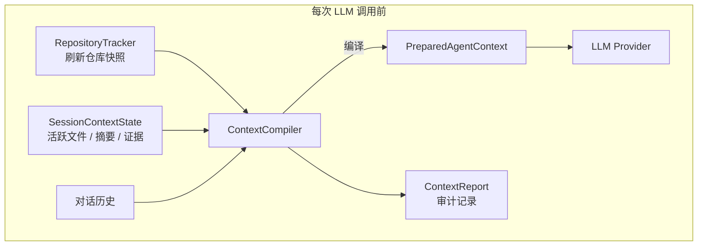

# 上下文治理：从问题到设计

> 本文档是 Codepilot 上下文治理系统的教学文档。它会先带你理解"为什么需要治理"，再讲解"怎么治理"，最后指出代码中最值得学习的设计亮点。

---

## 1. 为什么需要上下文治理

### 1.1 朴素做法：把所有历史都塞给模型

最简单的 Coding Agent 只需要一个消息列表：

```text
用户提问 → 追加到 messages → 发给 LLM → 拿到回复 → 追加到 messages → 循环
```

这种做法在对话很短时没问题，但随着交互增加，会出现几个典型问题：

| 问题 | 具体表现 |
|------|----------|
| **窗口溢出** | 消息越来越多，最终超过模型的 context window 限制 |
| **信息过时** | 文件被修改后，旧的 Read 结果仍然留在历史里，模型可能基于过时代码做判断 |
| **噪音淹没信号** | 早期探索的大量 grep/read 结果和当前任务无关，却占据宝贵的上下文空间 |
| **无法区分可信度** | 工具直接观察到的事实、模型的推测、用户提供的信息混在一起，模型难以分辨 |
| **仓库状态静止** | 如果运行过程中切换了分支、新增了文件，模型看到的仍是启动时的仓库快照 |

### 1.2 常见的"补丁式"方案及其局限

很多 Agent 用以下方式缓解上述问题，但每种都有明显局限：

**方案 A：消息数/Token 阈值截断**

```text
消息累积 → 超过阈值 → 丢弃最旧的消息
```

- 优点：简单
- 问题：可能丢掉关键的早期上下文（比如用户最初的需求描述）

**方案 B：历史摘要压缩**

```text
消息累积 → 超过阈值 → 用 LLM 把旧消息压缩成摘要 → 替换原消息
```

- 优点：保留了语义
- 问题：摘要本身可能过时；无法判断哪些摘要仍然有效

**方案 C：固定 System Prompt + 动态追加**

```text
启动时生成 System Prompt（含仓库信息）
→ 每次调用原样使用
→ 在 messages 末尾追加新的工具结果
```

- 优点：System Prompt 稳定
- 问题：仓库信息从不更新；上下文选择没有优先级

### 1.3 Codepilot 的核心洞察

> 上下文治理不是"尽量给模型更多信息"，而是"在有限窗口内持续提供**必要、最新、可追溯**的信息"。

这个洞察引出了三个设计目标：

1. **每轮编译**：上下文不是一次组装后不变的，而是每次模型调用前重新编译
2. **可信分层**：不同来源的信息有不同的可信度，过期信息必须失效
3. **预算控制**：每个 section 有 token 预算，超预算时按优先级裁剪

---

## 2. 整体架构



### 2.1 两层上下文：Bootstrap vs. Compile

Codepilot 的上下文分为两层，理解这个区分是理解整个系统的关键：

| 层 | 时机 | 职责 | 产物 |
|----|------|------|------|
| **Runtime Bootstrap** | 会话创建时，**只执行一次** | 扫描仓库、生成初始 System Prompt | 静态的 `system_prompt` |
| **ContextCompiler** | 每次 LLM 调用前，**每次都执行** | 刷新仓库、校验新鲜度、选择内容、控制预算 | 动态的 `PreparedAgentContext` |

Bootstrap 是"底稿"，Compile 是"每轮修订"。Compile 会替换 Bootstrap 中过时的部分（比如仓库状态），并追加动态信息（比如活跃文件、证据、记忆）。

### 2.2 关键文件一览

```
src/codepilot/
├── protocols/
│   └── context.py              # 稳定数据契约：所有层共享的类型定义
├── sessions/
│   └── context/
│       ├── state.py            # 会话级可变状态：ActiveFile, FileSummary, ContextEvidence
│       ├── repository_tracker.py  # 动态仓库快照：snapshot(), refresh(), compare()
│       ├── compiler.py         # 核心编译器：ContextCompiler.compile()
│       ├── repository_context.py  # 静态仓库 Bootstrap
│       └── compaction.py       # 历史压缩（与 Compile 互补）
├── runtime/
│   ├── assembly.py             # 组装层：把 compile 接入 AgentSession
│   ├── prompt.py               # PromptSection 排序与渲染
│   └── context.py              # RuntimeContext Bootstrap
└── core/
    └── llm_runner.py           # 调用入口：每次 LLM 前触发 compile
```

依赖方向：

```text
protocols  ←  sessions/context  ←  runtime  ←  core
```

Core 不理解仓库扫描、相关性评分和摘要失效规则；它只调用 `prepare_context()` 接口。

---

## 3. 核心数据结构详解

### 3.1 类型别名：治理词汇表

Codepilot 用三个 `Literal` 类型定义了上下文治理的"词汇表"：

```python
# src/codepilot/protocols/context.py

# 新鲜度：这个信息还能用吗？
ContextFreshness = Literal["fresh", "stale", "missing", "unknown"]

# 可信度：这个信息从哪来的？
ContextTrust = Literal["observed", "derived", "user_given", "model_claim"]

# 丢弃原因：为什么没选进最终上下文？
DroppedContextReason = Literal[
    "duplicate", "stale", "low_relevance",
    "over_budget", "superseded", "missing_source"
]
```

**教学要点**：用 `Literal` 而不是枚举类，是因为这些值需要跨层传递、序列化、在日志中可读。`Literal` 比 `Enum` 更轻量，且天然支持类型检查。

### 3.2 RepositorySnapshot：仓库的动态快照

```python
@dataclass(frozen=True)
class RepositorySnapshot:
    workspace_root: str
    project_type: str | None
    manifest_files: list[str]
    top_level_entries: list[str]
    test_directories: list[str]
    instruction_files: list[str]
    branch: str | None
    head_sha: str | None
    git_status: list[str]
    fingerprint: str                    # 整个工作区状态的 SHA-256
    instruction_hashes: dict[str, str]  # 每个指令文件的 SHA-256
    dirty_path_hashes: dict[str, str]   # 每个脏文件的 SHA-256
```

**为什么需要 `fingerprint`？**

Fingerprint 是整个工作区状态的哈希摘要。它的作用是**快速判断"有没有变化"**：

```text
fingerprint 未变化 → 复用上一轮的 Snapshot 文本，不用重新渲染
fingerprint 变化   → 生成新 Snapshot，计算 Delta
```

这避免了每轮都做昂贵的全文比对。

**教学要点**：`frozen=True` 保证快照不可变——一旦创建，就不会被意外修改。这是函数式编程中"值对象"的经典应用。

### 3.3 RepositoryDelta：两轮之间的差异

```python
@dataclass(frozen=True)
class RepositoryDelta:
    added_paths: list[str]
    modified_paths: list[str]
    deleted_paths: list[str]
    branch_changed: bool
    head_changed: bool
    instructions_changed: bool

    @property
    def changed(self) -> bool:
        return bool(
            self.added_paths or self.modified_paths
            or self.deleted_paths or self.branch_changed
            or self.head_changed or self.instructions_changed
        )
```

**为什么需要 Delta？**

Delta 的价值在于**只告诉模型"什么变了"，而不是每次都重复发送完整的仓库信息**。这既节省 token，也让模型能快速定位变化。

### 3.4 SessionContextState：会话级工作记忆

这是整个上下文治理系统中最重要的状态容器。它**不是第二份聊天历史**，而是存储紧凑的、绑定来源的事实。

```python
@dataclass
class SessionContextState:
    workspace_dir: Path
    active_files: dict[str, ActiveFile]        # 活跃文件集合
    file_summaries: dict[str, FileSummary]     # 文件摘要
    evidence: list[ContextEvidence]            # 证据列表（上限 80）
    last_repository_snapshot: RepositorySnapshot | None
    observed_tool_call_ids: set[str]           # 去重守卫
```

#### ActiveFile：谁在"关注"这个文件？

```python
@dataclass
class ActiveFile:
    path: str
    role: str           # target | test | dependency | config | reference
    reason: str         # 为什么进入活跃集合
    source_hash: str | None
    access_count: int
    last_accessed_at: float
```

**进入 Active Set 的来源**：

| 来源 | 说明 |
|------|------|
| 用户明确提及 | 用户说"修改 service.py" |
| Read 工具 | Agent 读取了文件 |
| Grep 命中 | 搜索结果引用了文件 |
| Edit/Write | Agent 修改了文件 |
| 测试错误引用 | 报错信息指向的文件 |
| 已知依赖 | 依赖关系推导 |

**role 的优先级**：

```text
target (100)  >  test (80)  >  dependency (70)  >  config (60)  >  reference (40)
```

当同一个文件被多次访问时，`access_count` 会累加（上限贡献 +10），且 role 只会升级不会降级（target 赢过 reference）。

#### FileSummary：文件的"身份证"

```python
@dataclass
class FileSummary:
    path: str
    summary: str
    source_hash: str          # 生成摘要时的文件 SHA-256
    relevant_symbols: list[str]
    created_at: float
    freshness: str = "fresh"  # fresh | stale | missing
```

**关键设计**：`source_hash` 绑定了摘要生成时的文件版本。当文件被修改后，hash 不再匹配，摘要自动变为 `stale`——**过期的摘要不会作为当前事实发送给模型**。

#### ContextEvidence：证据的"履历表"

```python
@dataclass
class ContextEvidence:
    kind: str                    # "tool_result" | "verification"
    content: str                 # 证据内容
    trust: str                   # "observed" | "derived" | "user_given" | "model_claim"
    source: str                  # 来源描述
    source_hash: str | None      # 关联文件的 hash
    workspace_fingerprint: str | None  # 关联的工作区指纹
    freshness: str = "fresh"
    path: str | None = None
    created_at: float
```

**可信度层级**（从高到低）：

| trust 值 | 含义 | 例子 |
|----------|------|------|
| `observed` | 工具直接观察到 | Read 读到的文件内容、pytest 执行结果 |
| `derived` | Runtime 根据确定规则推导 | 文件 hash 变化 → 摘要过期 |
| `user_given` | 用户提供，未必验证 | 用户说"这个函数有 bug" |
| `model_claim` | 模型之前的结论，未验证 | 模型说"我猜原因是 X" |

**教学要点**：这个分层解决了一个常见问题——模型容易把旧推测当成已确认的事实。通过给不同来源打上 trust 标签，编译器可以在预算紧张时优先保留高可信度的内容。

---

## 4. ContextCompiler：编译流水线

`ContextCompiler.compile()` 是整个系统的核心方法。它在每次 LLM 调用前执行，将原始材料编译成最终的上下文。

### 4.1 编译流程（七步）

```text
Step 1: Refresh       刷新 RepositorySnapshot，计算 Delta
Step 2: Observe       从消息中提取工具结果，更新 State
Step 3: Validate      校验文件 hash、工作区指纹，标记过期项
Step 4: Budget        按比例分配各 section 的 token 预算
Step 5: Select        按优先级选择各 section 的内容
Step 6: Render        渲染治理上下文（活跃文件、证据、失效通知）
Step 7: Report        生成 ContextReport 审计记录
```

### 4.2 预算分配

总预算的计算：

```python
input_budget = min(
    max(1024, context_window - max_output - safety_margin),
    hard_cap
)
```

各 section 的比例分配：

| Section | 比例 | 职责 |
|---------|------|------|
| repository_state | 10% | 仓库快照与 Delta |
| active_files | 15% | 关键文件的原文/摘要 |
| recent_evidence | 17% | 工具结果、测试结果、验证证据 |
| memory | 15% | 长期记忆召回 |
| history | 28% | 对话历史（优先压缩） |
| current_task | 15% | 当前任务目标与约束 |

**教学要点**：比例加起来是 100%，但 `current_request`（当前用户请求）**不参与预算分配**——它永远保留，不会被裁剪。这是"当前请求不可失真"原则的工程实现。

### 4.3 内容选择算法

`_select_items()` 是预算执行的核心函数：

```python
def _select_items(items: list[ContextItem], budget: int) -> tuple[list[ContextItem], list[DroppedContextItem]]:
    # 1. 按优先级降序排列
    sorted_items = sorted(items, key=lambda x: x.priority, reverse=True)

    selected = []
    dropped = []
    used_tokens = 0

    for item in sorted_items:
        # 2. 跳过过期项
        if item.freshness in ("stale", "missing"):
            dropped.append(DroppedContextItem(item_id=item.id, reason="stale", ...))
            continue

        # 3. 预算检查
        if used_tokens + item.estimated_tokens > budget:
            # 特殊情况：第一个 item 超预算 → 截断而非丢弃
            if not selected:
                item = truncate(item, budget)
                selected.append(item)
            else:
                dropped.append(DroppedContextItem(item_id=item.id, reason="over_budget", ...))
            continue

        selected.append(item)
        used_tokens += item.estimated_tokens

    return selected, dropped
```

**教学要点**：这里有一个细节值得学习——当第一个 item 就超预算时，选择**截断**而不是**丢弃**。这保证了即使预算很紧，模型至少能看到部分内容。

### 4.4 优先级计算

不同 section 有不同的优先级计算逻辑：

**Active Files**：

```python
priority = role_score + min(access_count, 10)

# role_score:
#   target     = 100
#   test       = 80
#   dependency = 70
#   config     = 60
#   reference  = 40
```

**Evidence**：

```python
priority = trust_score + index  # index 是在证据列表中的位置（越新越大）

# trust_score:
#   observed     = 100
#   derived      = 80
#   user_given   = 60
#   model_claim  = 20
```

**Memory**：

```python
# pinned 记忆：priority = 1000（绝对优先）
# 召回记忆：priority = retrieval_score（相关性分数）
```

---

## 5. 新鲜度追踪：让过期信息自动失效

新鲜度追踪是 Codepilot 上下文治理中最具教学价值的设计之一。

### 5.1 三层失效机制

```text
┌─────────────────────────────────────────────────────┐
│                    外部修改检测                       │
│  RepositoryTracker.refresh() → RepositoryDelta       │
│  → 路径变化时调用 invalidate_paths()                  │
└─────────────────────────────────────────────────────┘
                          ↓
┌─────────────────────────────────────────────────────┐
│                    主动失效                          │
│  Edit/Write 工具执行后                               │
│  → state.invalidate_paths(affected_paths)            │
│  → state.invalidate_verification()                   │
└─────────────────────────────────────────────────────┘
                          ↓
┌─────────────────────────────────────────────────────┐
│                    来源校验                          │
│  validate_sources(fingerprint)                       │
│  → 检查文件是否存在、hash 是否匹配                     │
│  → 标记 fresh / stale / missing                      │
└─────────────────────────────────────────────────────┘
```

### 5.2 验证结果的工作区绑定

```python
@dataclass(frozen=True)
class VerificationEvidence:
    command: str
    exit_code: int
    workspace_fingerprint: str  # 绑定到执行时的工作区状态
    created_at: float
```

**关键设计**：测试结果绑定到 `workspace_fingerprint`。当代码被修改后，工作区指纹变化，旧的测试结果自动失效——**"测试通过"的结论不会在代码修改后继续有效**。

### 5.3 失效后的处理

```text
fresh    → 正常进入上下文
stale    → 不发送旧内容，只发送失效通知
missing  → 移除内容，记录文件已删除
unknown  → 可作为线索，不可标记为已确认事实
```

失效通知示例（写入 System Prompt）：

```markdown
### Invalidated context
- [stale] file_summary:src/service.py — 文件自上次读取后已变化，依赖前请重新读取
- [stale] verification:pytest — 工作区已修改，旧测试结果不再有效
```

**教学要点**：这里体现了"工程约束优先于 Prompt 提醒"的设计哲学。不是告诉模型"请小心过期信息"，而是**从工程层面确保过期信息不会作为事实出现在上下文中**。

---

## 6. ContextReport：让治理过程可解释

每次编译都会生成一份 `ContextReport`，记录"最终给模型看了什么、为什么这么选"。

```python
@dataclass
class ContextReport:
    context_id: str
    repository_fingerprint: str
    total_budget_tokens: int
    estimated_tokens_before: int
    estimated_tokens_after: int
    sections: list[ContextSectionReport]
    stale_items: list[str]
    dropped_items: list[DroppedContextItem]
    repository_delta: RepositoryDelta | None
    retrieved_memory_ids: list[str]
    memory_retrieval_reasons: list[str]
```

每个 section 的报告：

```python
@dataclass
class ContextSectionReport:
    name: str
    budget_tokens: int
    candidate_items: int       # 候选数量
    selected_items: int        # 最终入选数量
    estimated_tokens_before: int
    estimated_tokens_after: int
    reduction_policy: str
```

丢弃项的记录：

```python
@dataclass
class DroppedContextItem:
    item_id: str
    section: str
    reason: DroppedContextReason  # "stale" | "over_budget" | "duplicate" | ...
    source: str
```

**教学要点**：ContextReport 的存在让上下文治理从"黑盒"变成了"白盒"。当你调试"为什么模型不知道某个文件的内容"时，可以通过 Report 看到它是被裁掉了、过期了、还是从未进入候选。

---

## 7. 与历史压缩（Compaction）的关系

ContextCompiler 和 Session Compaction 是**互补**的两层：

| 维度 | ContextCompiler | Session Compaction |
|------|----------------|-------------------|
| 时机 | 每次 LLM 调用前 | 对话历史过长时 |
| 目标 | 生成当前最合适的工作上下文 | 控制持久化历史的体积 |
| 处理对象 | 活跃文件、证据、记忆、历史 | 完整的消息历史 |
| 产物 | 临时的 PreparedAgentContext | 持久化的压缩摘要 |

```text
完整 Session 历史
    → ContextCompiler 按轮选择（每次 LLM 调用前）

当持久化历史持续过大
    → Session Compaction 生成长期摘要
    → 摘要作为低优先级 ContextItem 参与后续选择
```

**教学要点**：不要把 Compaction 当成"简陋版的 ContextCompiler"。Compaction 解决的是存储问题（session 文件不能无限增长），ContextCompiler 解决的是质量问题（每次给模型的上下文应该是什么）。两者各司其职。

---

## 8. 最值得学习的设计亮点

### 亮点 1：每轮编译，而非一次组装

```text
传统做法：
  用户提问 → 组装上下文 → 发给 LLM → 拿到回复 → 循环
  （上下文只在用户提问时组装一次）

Codepilot 做法：
  用户提问 → [编译上下文 → 发给 LLM → 执行工具 → 更新 State] × N 轮
  （每次 LLM 调用前都重新编译）
```

为什么这很重要？因为一次用户请求可能触发多轮工具调用：

```text
模型 → Read 文件 A → 模型 → Edit 文件 A → 模型 → Bash 运行测试 → 模型
```

每轮工具执行后，工作区和可用证据都可能变化。如果只在用户提问时刷新一次，后续轮次的上下文就会过时。

### 亮点 2：可信度分层，而非平等对待

传统做法把所有信息当作同等重要的文本。Codepilot 给每条信息打上 `trust` 标签：

```text
工具直接读到的代码 > Runtime 推导的状态 > 用户的说法 > 模型自己的推测
```

这让编译器在预算紧张时能做出合理的取舍——优先保留高可信度的内容，而不是随机裁剪。

### 亮点 3：来源绑定与自动失效

```python
# 摘要绑定到文件版本
FileSummary.source_hash = "abc123"

# 验证结果绑定到工作区状态
VerificationEvidence.workspace_fingerprint = "def456"

# 文件被修改后 → hash 不匹配 → 自动失效
```

这解决了"模型基于过时信息做判断"的问题。不是通过 Prompt 提醒模型"请注意信息可能过时"，而是**从工程层面确保过期信息不会作为事实出现在上下文中**。

### 亮点 4：预算控制的"截断而非丢弃"策略

当第一个 item 就超预算时，Codepilot 选择截断它而不是丢弃：

```python
if not selected:  # 第一个 item
    item = truncate(item, budget)
    selected.append(item)
```

这个细节体现了"宁可给模型看一部分，也不能什么都不给"的设计智慧。

### 亮点 5：治理过程的可观测性

`ContextReport` 记录了每次编译的完整审计信息：

- 每个 section 用了多少 token
- 哪些内容被裁剪了，为什么
- 哪些证据已过期
- 仓库发生了什么变化

这让调试"模型为什么不知道 X"变得可追溯——你可以查 Report，而不是猜测。

---

## 9. 集成点：compile() 是怎么被调用的

理解 compile() 的调用链路，有助于理解整个系统是怎么串联起来的。

### 9.1 组装阶段

在 [assembly.py](src/codepilot/runtime/assembly.py) 中，`ContextCompiler.compile` 被作为回调注入：

```python
# src/codepilot/runtime/assembly.py
context_state = SessionContextState(workspace_dir=inputs.workspace)
context_compiler = ContextCompiler(workspace=str(inputs.workspace), state=context_state)

session_options = AgentSessionOptions(
    # ...
    prepare_context=context_compiler.compile,  # 注入回调
)
```

### 9.2 调用阶段

在 [llm_runner.py](src/codepilot/core/llm_runner.py) 中，每次 LLM 调用前触发 compile：

```python
# src/codepilot/core/llm_runner.py
if self._config.prepare_context:
    prepared = await maybe_await(
        self._config.prepare_context(
            context,
            ContextPreparationRequest(
                session_id=self._config.session_id,
                model_context_window=self._config.model.context_window,
                model_max_output_tokens=self._config.model.max_tokens,
                signal=signal,
            ),
        )
    )
    # prepared 替换原始 context
    # 发射 context_prepared 事件用于可观测
```

**教学要点**：这里用了**依赖注入**的设计模式——Core 层不直接依赖 ContextCompiler，而是通过 `PrepareContextFn` 回调接口调用。这保持了依赖方向的清晰：`core` 不 import `sessions`。

---

## 10. 设计原则总结

| 原则 | 含义 | 代码体现 |
|------|------|----------|
| 每轮编译 | 上下文在每次 LLM 调用前重新编译 | `compile()` 在 `llm_runner.py` 中被调用 |
| 原始证据优先 | 工具直接观察 > Runtime 推导 > 用户输入 > 模型推测 | `ContextTrust` 四级分层 |
| 先源头控制再最终裁剪 | 截断长输出 → 去重 → 摘要降级 → 历史压缩 → section 预算 | 多层裁剪策略 |
| 当前请求不可失真 | 用户请求、安全规则、硬性约束永不裁剪 | `current_request` 不参与预算分配 |
| 治理可解释 | 每次编译生成审计报告 | `ContextReport` 记录完整决策过程 |

---

## 11. 思考题

如果你在学习这个系统，可以尝试回答以下问题来检验理解：

1. **为什么 `RepositorySnapshot` 用 `frozen=True`？** 如果不用会有什么问题？

2. **为什么 evidence 列表上限是 80？** 如果不限制会怎样？

3. **为什么 `trust` 分为四级而不是简单的"可信/不可信"？** 在什么场景下四级比两级更有用？

4. **ContextCompiler 和 Compaction 的职责边界在哪里？** 如果把两者合并会有什么问题？

5. **为什么用 `prepare_context` 回调而不是让 Core 直接调用 ContextCompiler？** 这对可测试性有什么影响？

6. **`fingerprint` 的设计有什么好处？** 如果每次都做完整的 diff 比对会怎样？

7. **验证结果为什么要绑定 `workspace_fingerprint`？** 只绑定 `file_hash` 够不够？
