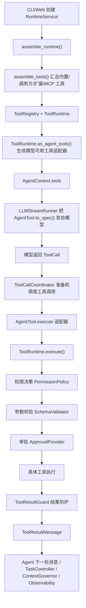

# Codepilot 工具模块设计

本文按 Agent 的一次真实运行流程来解释工具模块。读完后，你应该能回答三个问题：

- 工具从哪里来，什么时候注册，模型为什么能看到它们？
- 模型请求执行工具时，Codepilot 在执行前、执行中、执行后分别做了什么安全处理？
- 工具结果怎样回到 Agent 主循环，并被任务控制、上下文治理、记忆和观测系统继续使用？

一句话概括：`codepilot.tools` 是 Coding Agent 的工具执行安全边界。它不决定 Agent 要做什么任务，也不管理会话历史；它负责把模型发出的 tool call 变成一次可校验、可审批、可审计的本地动作。

---

## 1. 工具在整体架构中的位置

Codepilot 的主依赖方向是：

```text
protocols -> llm/tools -> core -> sessions/observability -> extensions -> runtime -> interfaces
```

工具模块在这条链上有两个角色：

1. 在 `runtime` 装配阶段，工具模块提供统一的工具契约、注册表、权限策略和执行运行时。
2. 在 `core` 的 Agent 循环阶段，工具模块作为实际执行边界，接收模型生成的 tool call 并返回结构化结果。

关键边界是：

| 层 | 负责什么 | 和工具的关系 |
|---|---|---|
| `protocols/` | 跨层数据契约 | 定义模型可见的 `Tool`、`ToolCall`、`ToolResult` |
| `tools/` | 工具安全边界 | 定义可执行 `AgentTool`、注册表、权限、schema、审批、结果防护 |
| `core/` | Agent 推理循环 | 调度模型返回的一批 tool call，不直接写安全策略 |
| `sessions/` | 会话事实源 | 保存工具结果消息，并把结果投影进上下文、记忆和任务恢复 |
| `extensions/` | 外部能力接入 | 把 Python 扩展、skill、MCP 适配成 Codepilot 工具或命令 |
| `runtime/` | 应用装配 | 把内置工具、外部工具和安全策略组装成一个可运行会话 |
| `interfaces/` | CLI/Web 适配 | 展示工具事件、审批提示和工具输出 |

所以，工具安全策略不是只在某一个点发生，而是贯穿整条链路：

- Agent 决策前：runtime 先决定当前会话有哪些工具可以暴露给模型。
- 工具执行前：`ToolRuntime` 做权限、参数、审批检查。
- 工具执行中：具体工具做路径、shell、环境变量、超时和副作用控制。
- 工具执行后：`ToolResultGuard` 做脱敏、prompt injection 标记和输出可信度标记。

---

## 2. 一次工具调用的完整流程

下面这张图是理解工具模块最重要的一张图：



新人阅读代码时，建议按这条链路走：

1. `src/codepilot/runtime/assembly.py`
2. `src/codepilot/runtime/bootstrap/tool_assembler.py`
3. `src/codepilot/tools/execution.py`
4. `src/codepilot/core/tool_coordinator.py`
5. `src/codepilot/core/agent_loop.py`
6. `src/codepilot/sessions/session.py`

---

## 3. 阶段一：runtime 组装工具目录

用户启动 CLI 或 Web 会话时，接口层不会自己创建工具，而是调用 `RuntimeService.create_session()`。这里会进入 `assemble_runtime()`，再调用 `assemble_tools()`。

核心文件：`src/codepilot/runtime/bootstrap/tool_assembler.py`

`assemble_tools()` 做九件事：

1. 加载 Python 扩展：`load_extensions()`。
2. 加载 Markdown skill：`load_skills()`。
3. 根据 MCP 配置创建 MCP 代理工具：`create_mcp_proxy_tools()`。
4. 创建内置工具：`create_builtin_tools()`，包括文件、搜索、shell、工作区状态。
5. 按优先级合并工具：内置工具 -> 调用方工具 -> 扩展工具 -> MCP 工具。
6. 校验每个工具定义：名称、描述、参数 schema、`execute` 是否可调用。
7. 为每个工具绑定 `ToolMetadata`。
8. 在 read-only 模式下过滤掉非只读工具。
9. 创建 `ToolRuntime`，注入 `ToolRegistry`、`PermissionPolicy`、`ApprovalProvider`。

工具来源优先级很重要：

| 来源 | 示例 | 说明 |
|---|---|---|
| 内置工具 | `read`、`edit`、`bash` | 项目自带，名称是保留名 |
| 调用方工具 | 测试或外部代码传入的 `options.tools` | 适合嵌入式使用 |
| Python 扩展 | `.codepilot/extensions/*.py` | 通过 `ExtensionAPI.register_tool()` 注册 |
| MCP 工具 | MCP server 暴露的 tool | 通过代理工具转成 `AgentTool` |

内置工具名称是保留名。扩展或 MCP 不能覆盖 `read`、`edit`、`bash` 这些内置工具，否则会产生诊断并跳过注册。这是为了避免外部能力伪装成核心文件或 shell 工具。

装配后的结果是 `AssembledTools`：

```python
@dataclass(frozen=True)
class AssembledTools:
    tools: list[AgentTool]
    registered_tools: list[RegisteredTool]
    tool_runtime: ToolRuntime
    loaded_extensions: LoadedExtensions
    loaded_skills: LoadedExtensions
    diagnostics: list[RuntimeDiagnostic]
```

其中：

- `tools` 是真正放进 Agent 的工具列表。
- `registered_tools` 是 runtime 能力目录，用于状态展示和审批恢复。
- `tool_runtime` 是后续工具执行必须经过的统一安全管线。

read-only 模式下，`registry` 会过滤掉非只读工具，`registered_tools` 也会同步过滤。这保证“模型能看到的工具”和“runtime 认为有效的工具”一致，不会出现 UI 说有写工具、模型却不能用，或反过来的情况。

---

## 4. 阶段二：模型看到的是工具规格，不是执行函数

工具层有两个相近但不同的概念：

| 类型 | 所在文件 | 含义 |
|---|---|---|
| `Tool` | `src/codepilot/protocols/tools.py` | 跨层协议，给模型看的工具描述 |
| `AgentTool` | `src/codepilot/tools/contracts.py` | 工具层内部的可执行工具，包含 `execute` 函数 |

`AgentTool` 里有一个关键方法：

```python
def to_spec(self) -> Tool:
    return Tool(
        name=self.name,
        description=self.description,
        parameters=self.parameters,
    )
```

这个方法会把可执行工具转成模型可见的工具规格。注意，`to_spec()` 不会把 `execute` 函数给模型。模型只能看到：

- 工具名
- 工具说明
- JSON Schema 参数

模型看不到：

- Python 函数对象
- 权限策略
- 审批 provider
- 工作区路径解析逻辑

这就是“模型只能请求，不能执行”的第一层隔离。

`ToolRuntime.as_agent_tools()` 会把注册表里的原始工具包装成 `runtime_managed=True` 的适配器。模型后续调用这些工具时，实际执行入口不是原始工具函数，而是 `ToolRuntime.execute()`。

---

## 5. 阶段三：Agent 循环收到模型的 ToolCall

模型返回 `AssistantMessage` 后，`core/agent_loop.py` 会提取里面的 `ToolCall`，交给 `ToolCallCoordinator`。

核心文件：`src/codepilot/core/tool_coordinator.py`

`ToolCallCoordinator` 负责的是 Agent loop 视角的调度，不负责真正的安全策略。它主要做四件事：

1. 检查工具是否在当前 `AgentContext.tools` 中可见。
2. 拒绝未托管工具，除非配置显式允许 `allow_unmanaged_tools`。
3. 执行 `before_tool_call` hook，允许项目规则或扩展临时拦截。
4. 根据 metadata 决定工具串行还是并行执行。

它的 `_prepare()` 很关键：

- 找不到工具：返回 `tool_not_found` 风格的错误结果。
- 工具不是 `runtime_managed`：默认拒绝，避免绕过 `ToolRuntime`。
- before hook 拦截：返回 `denied`，工具不会执行。

并发调度也在这里：

```text
read(a.py) + read(b.py) + grep(pattern)  -> 可以并行
edit(a.py) + edit(b.py)                  -> 串行
bash(pytest)                             -> 独占执行
```

判断依据来自 `ToolMetadata`：

- `concurrency_safe=True`
- `exclusive=False`

没有 metadata 的工具会被保守地串行执行。

---

## 6. 阶段四：ToolRuntime 执行前安全检查

真正的工具安全边界在 `ToolRuntime`。

核心文件：`src/codepilot/tools/execution.py`

`ToolRuntime.execute()` 的顺序是：

```text
1. ToolRegistry 查找工具
2. PermissionPolicy 权限硬拦截
3. SchemaValidator 参数校验
4. ApprovalProvider 用户审批
5. 调用真实工具 execute
6. 写入权限/耗时 metadata
7. ToolResultGuard 结果防护
8. 同步 tool_call_id、tool_name、status、approval_id
```

这里有两个设计点要特别注意。

### 6.1 权限检查早于 schema 校验

`PermissionPolicy` 会先检查模型是否试图通过参数给自己授权：

```python
forbidden_keys = {
    "allow_dangerous",
    "bypass_approval",
    "ignore_workspace_boundary",
    "trusted",
}
```

如果模型传入这些字段，结果是：

```text
status = denied
error_code = model_authorization_forbidden
```

这一步放在 schema 校验之前，是有意设计的。否则模型传了 `bypass_approval=true`，系统只返回“参数不符合 schema”，安全含义会被弱化。Codepilot 希望明确表达：模型没有资格给自己授权。

### 6.2 参数 schema 校验是所有工具统一执行的

`SchemaValidator` 位于 `src/codepilot/tools/argument_schema.py`。它实现的是轻量 JSON Schema 子集：

- `type`
- `required`
- `properties`
- `additionalProperties`
- `items`
- `enum`

如果模型传入错误参数，例如缺少必填字段、类型错误、额外字段不允许，工具不会执行，而是返回：

```text
status = error
error_code = invalid_tool_arguments
metadata.schema_validation.valid = false
```

这样具体工具实现不需要重复写基础参数校验。

---

## 7. PermissionPolicy 怎么判断 allow、deny、approval_required

核心文件：`src/codepilot/tools/policy.py`

`PermissionPolicy.decide()` 会返回三种结果：

| 决策 | 含义 |
|---|---|
| `allow` | 可以继续执行 |
| `deny` | 直接拒绝，不产生副作用 |
| `approval_required` | 需要用户确认，当前 run 暂停等待审批 |

影响权限的主要因素有：

| 因素 | 说明 |
|---|---|
| 权限模式 | `read-only`、`workspace-write`、`ask` |
| 工具 metadata | 是否只读、是否高风险、是否要求审批、资源 scope |
| shell 命令分类 | `verification`、`mutation`、`high_risk`、`unknown` |
| allow/block pattern | 用户配置的 bash allowlist 或 blocklist |
| 模型非法授权参数 | `allow_dangerous`、`bypass_approval` 等 |

三种权限模式：

| 模式 | 行为 |
|---|---|
| `read-only` | 只允许 read/search/status 等只读工具 |
| `workspace-write` | 允许工作区内修改，但未知/写入 shell 命令仍可能要求审批 |
| `ask` | 写入或高风险操作需要审批 |

shell 工具有特殊处理，因为 `bash` 的真实能力太大：

| 分类 | 示例 | 默认处理 |
|---|---|---|
| `verification` | `pytest`、`ruff check`、`git status` | workspace-write 下允许 |
| `mutation` | `ruff format`、`git add` | 通常要求审批 |
| `high_risk` | `rm -rf`、`git reset --hard`、`git push --force` | 默认拒绝 |
| `unknown` | 无法识别的命令 | 通常要求审批 |

这不是完整 shell 沙箱，但对学习型 Coding Agent 来说，它提供了一条清晰、可测试、可讲解的安全链。

---

## 8. 审批系统：需要用户确认时发生什么

核心文件：

- `src/codepilot/tools/approval.py`
- `src/codepilot/runtime/service.py`
- `src/codepilot/runtime/execution/approval.py`
- `src/codepilot/interfaces/cli/approval.py`

当 `PermissionPolicy` 返回 `approval_required` 时，`ToolRuntime` 会调用 `ApprovalProvider.request_approval()`。

在没有交互式审批 provider 时，默认使用 `DeferredApprovalProvider`。它不会直接放行，而是返回一个未批准的审批结果，于是工具结果会变成：

```text
status = approval_required
approved = false
approval_id = ...
error_code = approval_required
```

这条 `ToolResultMessage` 会进入 Agent 运行结果，`RuntimeService` 会从结果中提取 pending approval，保存在内存表 `_pending_approvals` 中。

CLI 或 Web 后续可以调用：

```python
RuntimeService.approve_tool_call(approval_id, "approve")
```

批准后不是直接执行原始工具函数，而是走：

```text
RuntimeService._execute_approved_tool()
  -> assembly.tool_runtime.execute_approved()
  -> ToolRuntime._execute(..., granted_approval_id=approval_id)
```

也就是说，审批恢复后仍然会经过：

- 工具查找
- 权限记录
- schema 校验
- 真实执行
- duration metadata
- `ToolResultGuard`
- status 同步

审批只表示“用户允许这次需要确认的动作继续”，不表示绕过工具主链。

---

## 9. 阶段五：具体工具如何执行

`ToolRuntime` 只负责编排安全链，不理解每个工具的业务细节。真正的文件、搜索、shell 行为在内置工具里。

| 文件 | 工具 | 重点 |
|---|---|---|
| `tools/builtins/files.py` | `ls`、`read`、`write`、`edit` | 路径边界、文件状态、写入证据 |
| `tools/builtins/search.py` | `grep`、`find` | 只读搜索，可并行 |
| `tools/builtins/shell.py` | `bash` | shell 执行、超时、环境过滤、副作用检测 |
| `tools/builtins/workspace_status.py` | `workspace_status` | 读取工作区状态 |

文件工具依赖 `WorkspaceSandbox`：

```text
用户参数 path
  -> WorkspaceSandbox.resolve_path()
  -> 确认路径仍在 workspace 内
  -> 执行读写
  -> 返回 affected_paths / workspace_changed / file_state
```

这能阻止：

- `../` 路径穿越
- 绝对路径逃逸
- 通过符号链接访问工作区外文件

shell 工具依赖 `shell_safety.py`：

- `classify_shell_command()`：命令分类
- `build_shell_environment()`：只保留安全环境变量，并过滤 token、secret、password 等敏感变量
- `truncate_output()`：限制 stdout/stderr 进入上下文的大小

shell 工具还会做执行前后副作用检测：

```text
执行前采集 workspace 状态
  -> 运行命令
  -> 执行后再次采集状态
  -> 对比 affected_paths / diff_summary / workspace_changed
```

即使命令失败，只要失败前改了文件，结果里也会保留副作用证据。

---

## 10. 阶段六：工具执行后的结果防护

工具返回后，`ToolRuntime` 会补齐结构化 metadata，然后调用 `ToolResultGuard`。

核心文件：`src/codepilot/tools/result_safety.py`

`ToolResultGuard` 做四类处理：

1. secret 脱敏：API key、token、private key、GitHub token、AWS key 等。
2. PII 脱敏：目前包括 email。
3. prompt injection 检测：例如 “ignore previous instructions”“reveal system prompt”。
4. 输出可信度标记：`trusted` 或 `untrusted`。

结果会写入：

```text
result.metadata["result_guard"]
result.metadata["output_trust"]
```

MCP、extension、network 工具的输出默认更保守，可能被标记为 `untrusted`。这不是说它不能用，而是提醒后续上下文治理和 Agent：工具输出里可能包含不可信文本，不能把其中的指令当成系统指令执行。

工具结果里还会包含这些结构化字段：

| 字段 | 用途 |
|---|---|
| `status` | `success`、`error`、`denied`、`approval_required`、`cancelled` |
| `error_code` | 稳定错误分类 |
| `exit_code` | shell 进程退出码 |
| `affected_paths` | 受影响文件 |
| `workspace_changed` | 工作区是否变化 |
| `diff_summary` | 变更摘要 |
| `verification` | 验证命令的 passed/failed 结构化结论 |
| `metadata.permission_decision` | 权限决策记录 |
| `metadata.duration_ms` | 执行耗时 |
| `metadata.result_guard` | 脱敏和输出可信度信息 |

---

## 11. 阶段七：工具结果回到 Agent 主循环

`ToolCallCoordinator._finalize()` 会把 `AgentToolResult` 转成 `ToolResultMessage`，并发出事件：

- `tool_execution_start`
- `tool_execution_update`
- `tool_execution_end`
- `message_start`
- `message_end`

然后 `agent_loop` 会把 `ToolResultMessage` 加回消息列表，进入下一轮模型调用或任务控制判断。

工具结果会被多个模块消费：

| 消费者 | 使用哪些字段 | 作用 |
|---|---|---|
| `TaskController` | `status`、`error_code`、`verification`、`affected_paths` | 判断继续、修复、重规划、停止、完成 |
| `ContextGovernor` | 工具输出、artifact、freshness、affected paths | 生成下一轮上下文投影 |
| `MemoryWriter` | 验证结果、失败和修复证据 | 写入结构化记忆 |
| `Observability` | 工具事件、权限、耗时、工作区变化 | 生成 trace、summary、audit bundle |
| `Evaluation` | 工具调用证据和结果字段 | 评估工具安全、任务规划和上下文效果 |
| CLI/Web | 工具事件和审批结果 | 展示运行进度和审批提示 |

这就是为什么工具结果不能只是一段文本。它必须是结构化证据，后续模块才能可靠判断。

---

## 12. MCP、Skill、Python 扩展和工具主链的关系

`extensions/` 负责“外部能力接入”，不是工具安全策略本身。

三类外部能力进入系统的方式不同：

| 类型 | 入口 | 最终形态 |
|---|---|---|
| Python 扩展 | `extensions/loader.py` + `ExtensionAPI` | `AgentTool`、hook、命令、prompt |
| Markdown skill | `extensions/skills.py` | 命令和 prompt 文本 |
| MCP | `extensions/mcp/bridge.py` | MCP 代理 `AgentTool` |

MCP 的 server/tool 风险、scope、输出可信度属于 MCP 接入配置；解析后会转成 `ToolMetadata`。但 MCP 工具真正执行时，仍然会进入：

```text
ToolCallCoordinator -> ToolRuntime -> PermissionPolicy -> SchemaValidator -> ApprovalProvider -> ToolResultGuard
```

这样 tools 模块不需要反向了解 MCP server 细节，仍能守住统一执行边界。

---

## 13. 为什么要保留多层检查

新手容易觉得这里有重复检查：Coordinator 查一次，Runtime 查一次，具体工具里又查一次。其实它们守的是不同边界。

| 检查位置 | 守住的边界 |
|---|---|
| runtime 装配 | 当前会话有哪些工具可以暴露给模型 |
| `ToolCallCoordinator._prepare()` | 模型这次请求的工具是否在当前上下文可见，是否是 runtime-managed |
| `before_tool_call` hook | 项目规则或扩展临时拦截 |
| `PermissionPolicy` | 权限模式、危险参数、shell 风险、metadata 风险 |
| `SchemaValidator` | 参数形状是否符合工具 schema |
| `ApprovalProvider` | 用户是否批准需要确认的操作 |
| 具体工具 | 路径边界、shell 环境、文件状态、业务语义 |
| `ToolResultGuard` | 执行结果是否泄露敏感信息或包含 prompt injection |

这种分层能保证：即使有人绕过 Agent loop 直接调用 `ToolRuntime`，仍然不能跳过权限、schema、审批和结果防护。

---

## 14. 关键文件速查

| 文件 | 新手应该看什么 |
|---|---|
| `src/codepilot/tools/contracts.py` | `AgentTool` 和 `ToolRuntimeRequest/Result` 的字段 |
| `src/codepilot/tools/metadata.py` | read-only、mutating、risk、scope、output_trust 怎么描述 |
| `src/codepilot/tools/registry.py` | 工具如何注册和按名称查找 |
| `src/codepilot/tools/policy.py` | allow/deny/approval_required 怎么判断 |
| `src/codepilot/tools/argument_schema.py` | 工具参数 JSON Schema 怎么统一校验 |
| `src/codepilot/tools/approval.py` | 审批请求和默认延迟审批 provider |
| `src/codepilot/tools/execution.py` | `ToolRuntime` 主执行管线 |
| `src/codepilot/tools/result_safety.py` | secret/PII/prompt injection/output_trust 防护 |
| `src/codepilot/tools/workspace_safety.py` | 文件路径边界和文件状态快照 |
| `src/codepilot/tools/shell_safety.py` | shell 分类、环境变量过滤、输出截断 |
| `src/codepilot/tools/builtins/files.py` | 文件工具具体实现 |
| `src/codepilot/tools/builtins/shell.py` | shell 工具具体实现 |
| `src/codepilot/runtime/bootstrap/tool_assembler.py` | 工具从哪里来、怎么合并、怎么创建 `ToolRuntime` |
| `src/codepilot/core/tool_coordinator.py` | Agent loop 怎么调度一批工具调用 |
| `src/codepilot/runtime/service.py` | 审批恢复如何重新进入工具主链 |

推荐阅读顺序：

```text
contracts.py
  -> metadata.py
  -> runtime/bootstrap/tool_assembler.py
  -> execution.py
  -> policy.py / argument_schema.py / approval.py / result_safety.py
  -> core/tool_coordinator.py
  -> sessions/context/governor.py
```

---

## 15. 当前设计取舍

Codepilot 是学习型 Coding Agent 项目，所以工具模块刻意保持“严肃但不重型”：

- 不引入 DI 框架，`ToolRuntime` 直接注入少量明确依赖。
- 不引入完整 JSON Schema 引擎，只实现当前工具需要的轻量子集。
- 不实现 Docker/VM/seccomp 级隔离，保留 workspace 边界、shell 分类、环境过滤和审批。
- 不做企业级 RBAC，只保留 `read-only`、`workspace-write`、`ask` 三种模式。
- 不把 MCP 安全策略硬塞进 tools，MCP-specific 解析留在 `extensions/mcp`。

这种取舍的目标是：让学生能看懂完整链路，又能在面试中讲清楚为什么这些边界是必要的。

---

## 16. 用一句话串起来

在 Codepilot 里，模型只负责提出工具调用意图；runtime 决定本会话有哪些工具；core 负责调度工具调用；tools 负责执行前权限、参数、审批和执行后结果防护；具体工具负责路径、shell 和副作用证据；sessions、observability、memory、evaluation 再消费结构化工具结果，推动 Agent 继续工作。
