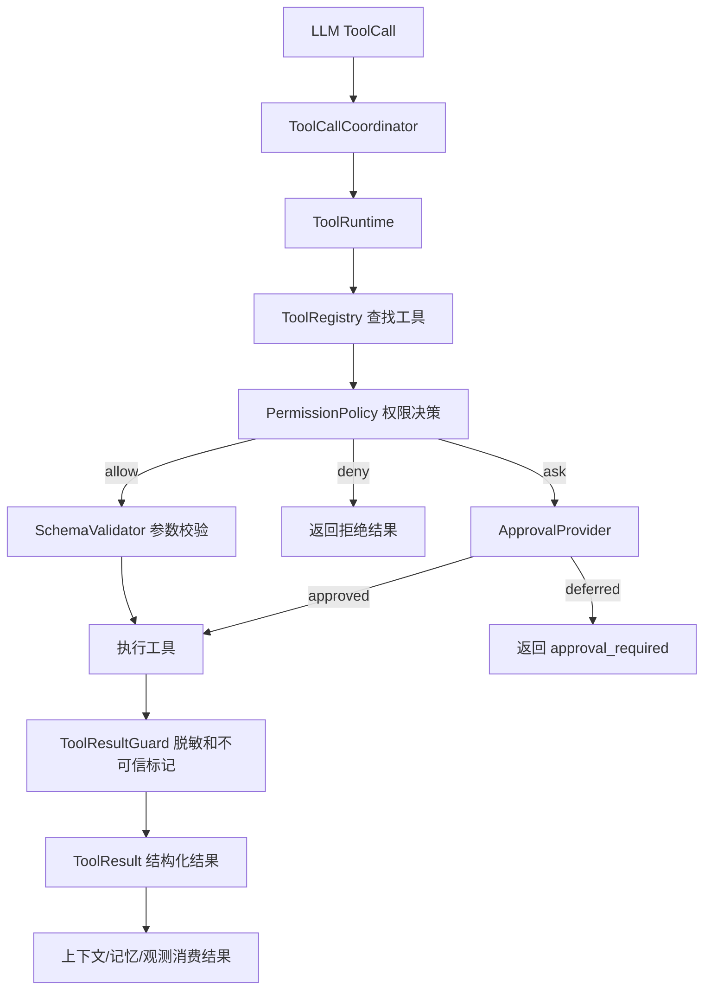

# Codepilot 工具系统设计与实现

## 1. 概述

工具系统是 Coding Agent 的核心基础设施。它不只是向 LLM 注册若干函数，而是需要回答一系列关键问题：

- 模型当前能看到哪些工具？
- 一次工具调用是否允许执行？
- 哪些操作必须经过用户确认？
- 多个工具调用应当串行还是并行？
- 工具执行后对工作区造成了什么影响？
- Agent 能否依据结构化证据继续判断？

本文档将从问题出发，逐步讲解 Codepilot 工具系统的设计思路和实现细节。

---

## 2. 之前工具模块存在的问题

在设计当前工具系统之前，我们首先分析了传统 Coding Agent 工具实现中常见的问题。

### 2.1 Shell 执行缺乏有效约束

许多 Coding Agent 的 `bash` 工具只是简单地将工作目录设为 workspace，但 Shell 进程仍然可以：

- 访问工作区以外的路径
- 读取父进程全部环境变量（包括密钥）
- 发起网络访问
- 产生超大输出拖垮上下文
- 执行删除、格式化等破坏性命令

**问题本质**：把"固定 cwd"描述成 Shell 沙箱是不准确的。

### 2.2 模型可以绕过安全限制

一些实现在工具参数中暴露了 `allow_dangerous`、`bypass_approval` 等字段，允许模型通过设置这些参数来绕过安全策略。

**问题本质**：模型本身不能成为安全策略的授权者。危险操作只能由用户配置、Runtime 策略或用户审批进行放行。

### 2.3 工具元数据与执行脱节

许多系统虽然定义了工具元数据（如 `read_only`、`exclusive`），但这些元数据仅用于展示，并未真正参与：

- 权限决策
- 并发调度
- 审计记录

**问题本质**：元数据如果不参与实际执行流程，就只是装饰。

### 2.4 工具结果缺乏结构化证据

传统的工具结果通常只返回一段文本输出，无法回答：

- 工作区是否发生了变化？
- 哪些文件被影响？
- 命令失败前是否已经产生修改？
- 输出是否被截断？

**问题本质**：Agent 无法基于结构化证据做出判断，只能猜测。

---

## 3. 设计原则

针对上述问题，Codepilot 工具系统遵循以下设计原则：

### 3.1 模型不能给自己授权

模型生成的任何参数都只能表达"希望做什么"，不能表达"允许我绕过安全限制"。

```python
# policy.py 中的实现
forbidden_keys = {
    "allow_dangerous",
    "bypass_approval",
    "ignore_workspace_boundary",
    "trusted",
}
attempted = sorted(forbidden_keys.intersection(request.params))
if attempted:
    return ToolDecision("deny", "model_authorization_forbidden", ...)
```

### 3.2 先判断，再执行

未知工具、参数错误、越界路径、危险命令，以及尚未获得用户确认的审批请求，必须在产生副作用前被拦截。

```python
# execution.py 中的执行流程
async def execute(self, request: ToolRuntimeRequest, ...) -> ToolRuntimeResult:
    # 1. 查找工具
    tool = self.registry.get(request.name)
    if tool is None:
        return self._blocked_result(...)

    # 2. 权限判断
    decision = self.permission_policy.decide(ToolRequest(...))
    if decision.denied:
        return self._blocked_result(request, decision)

    # 3. 审批检查（如果需要）
    if decision.requires_approval:
        approval = await self.approval_provider.request_approval(...)
        if not approval.approved:
            return ToolRuntimeResult(status="approval_required", ...)

    # 4. 执行工具
    result = await tool.execute(...)
    return ToolRuntimeResult(result=result, ...)
```

### 3.3 工具结果必须描述副作用

工具执行是否成功和工作区是否发生变化是两个不同维度。例如：命令退出码非 0，但命令失败前已经修改了文件。因此错误结果也必须保留已经发生的副作用证据。

---

## 4. 核心架构

Codepilot 工具系统由以下核心模块组成：

```text
src/codepilot/tools/
├── contracts.py       # 工具契约：AgentTool、ToolRuntimeRequest/Result
├── registry.py        # 工具注册表
├── metadata.py        # 内置/外部工具元数据
├── policy.py          # 权限策略
├── argument_schema.py # JSON Schema 参数校验
├── approval.py        # 审批抽象
├── execution.py       # ToolRuntime 统一执行管线
├── result_safety.py   # secret/PII/prompt injection 结果防护
├── workspace_safety.py# 工作区路径边界
├── shell_safety.py    # Shell 命令分类与策略
└── builtins/
    ├── __init__.py    # 工具装配
    ├── files.py       # ls, read, write, edit
    ├── search.py      # grep, find
    ├── shell.py       # bash
    └── workspace_status.py
```

### 4.1 执行流程



### 4.2 多层校验的职责边界

工具链路里会看到多处“检查”，但它们不应该检查同一件事，而是分别守住不同边界：

| 层级 | 负责什么 | 不负责什么 |
|------|----------|------------|
| `ToolCallCoordinator._prepare()` | 当前上下文是否可见该工具、unmanaged 工具是否允许、`before_tool_call` 是否拦截 | 不做具体权限策略、审批、路径和业务参数语义 |
| `before_tool_call` hook | 用户或扩展提供的项目规则、临时禁用、额外策略拦截 | 不作为唯一安全边界，不替代 Runtime 和工具自身校验 |
| `ToolRuntime.execute()` | Registry 真实工具查找、`PermissionPolicy` 决策、`SchemaValidator` 参数校验、用户审批、`ToolResultGuard` 结果防护、统一结果状态补齐 | 不理解每个工具的业务参数语义 |
| 具体工具 `execute()` | 参数语义、路径边界、文件状态、shell cwd/timeout、输出解码和副作用证据 | 不决定模型是否有权绕过权限策略 |

这种分层看起来像“重复检查”，但在 Agent 项目里是必要的防御深度：Coordinator 保证 agent loop 编排正确，Runtime 保证即使被直接调用也不会绕过权限，具体工具保证运行时状态变化后仍能安全执行。

当前项目定位是学生学习与求职展示，因此这里不引入复杂的 FSM、策略引擎或企业级沙箱，而是保留清晰、可解释、可测试的三层边界。

---

## 5. 工具注册与元数据

### 5.1 AgentTool 定义

每个工具由 `AgentTool` 数据类定义：

```python
@dataclass
class AgentTool:
    name: str                        # 工具名称
    label: str                       # 人类可读标签
    description: str                 # 工具描述
    parameters: dict[str, Any]       # JSON Schema 参数定义
    execute: ToolExecuteFn           # 执行函数
    runtime_managed: bool = False    # 是否由 ToolRuntime 管理
    metadata: ToolMetadata | None = None  # 工具元数据
```

**设计亮点**：`to_spec()` 方法返回面向 LLM 的工具描述（不含执行器），实现了执行逻辑与 LLM 描述的分离。

### 5.2 ToolRegistry 注册表

```python
@dataclass
class ToolRegistry:
    _tools: dict[str, AgentTool] = field(default_factory=dict)
    _metadata: dict[str, ToolMetadata] = field(default_factory=dict)

    def register(self, tool: AgentTool, *, metadata: ToolMetadata | None = None, replace: bool = True) -> None:
        self._tools[tool.name] = tool
        self._metadata[tool.name] = metadata or infer_tool_metadata(tool)
```

**设计亮点**：`registry.py` 只保存工具和 metadata；metadata 推断集中在 `metadata.py`，避免注册表同时承担命名推断职责。对于非内置工具，`infer_tool_metadata()` 可以根据工具名称自动推断元数据，避免每个工具都需要显式声明。

```python
def infer_tool_metadata(tool: AgentTool) -> ToolMetadata:
    name = tool.name
    read_only = name in {"read", "grep", "find", "ls", "workspace_status"}
    mutating = name in {"write", "edit", "bash"}
    category = _infer_category(name)
    return ToolMetadata(
        name=name,
        category=category,
        read_only=read_only,
        concurrency_safe=read_only,  # 只读工具可以并发
        exclusive=not read_only,     # 修改工具必须独占
        ...
    )
```

---

## 6. 权限决策系统

### 6.1 三种运行模式

| 模式 | 说明 | 适用场景 |
|------|------|----------|
| `read-only` | 只允许读取操作 | 代码审查、架构分析 |
| `workspace-write` | 允许工作区内写入 | 日常开发（默认） |
| `ask` | 写入操作需要审批 | 敏感项目 |

### 6.2 PermissionPolicy 决策流程

```python
@dataclass(frozen=True)
class PermissionPolicy:
    mode: ToolPermissionMode = "workspace-write"
    block_dangerous_bash: bool = True
    bash_allow_patterns: list[str] | None = None
    bash_block_patterns: list[str] | None = None

    def decide(self, request: ToolRequest) -> ToolDecision:
        # 1. 检查模型是否尝试绕过权限
        forbidden_keys = {"allow_dangerous", "bypass_approval", ...}
        if forbidden_keys.intersection(request.params):
            return ToolDecision("deny", "model_authorization_forbidden", ...)

        # 2. 只读模式下拒绝写操作
        if self.mode == "read-only" and not read_only:
            return ToolDecision("deny", "read_only_mode", ...)

        # 3. Shell 命令特殊处理
        if name == "bash":
            classification = classify_shell_command(command)
            # 高风险命令拒绝，验证命令允许，未知命令要求审批
            ...

        # 4. 其他工具根据元数据决策
        return ToolDecision("allow", "policy_allow", ...)
```

**设计亮点**：决策顺序精心设计，硬拒绝优先于 allowlist 和审批，确保安全底线不可绕过。

---

## 7. Shell 命令分类与策略

### 7.1 命令分类

Shell 命令被分为四类：

```python
ShellCommandClass = Literal["verification", "mutation", "high_risk", "unknown"]
```

| 分类 | 含义 | 示例 |
|------|------|------|
| `verification` | 验证型命令 | `pytest`, `ruff check`, `git status` |
| `mutation` | 修改型命令 | `ruff format`, `git add` |
| `high_risk` | 高风险命令 | `rm -rf`, `git push --force` |
| `unknown` | 未分类命令 | 需要审批 |

### 7.2 高风险命令识别

```python
_HIGH_RISK_PATTERNS = (
    r"\brm\s+-(?:[a-z]*r[a-z]*f|[a-z]*f[a-z]*r)\b",  # rm -rf
    r"\bgit\s+reset\s+--hard\b",                         # git reset --hard
    r"\bgit\s+push\b.*(?:--force|-f)\b",                 # git push --force
    ...
)
```

**设计亮点**：使用正则表达式而非完整 Shell AST 解析，保持实现简洁的同时覆盖主要风险场景。

### 7.3 复合命令的保守处理

```python
def _first_command(command: str) -> str:
    segments = re.split(r"(?:&&|\|\||;|\r?\n)", command)
    if len(segments) > 1:
        classes = {classify_shell_command(segment) for segment in segments}
        if classes == {"verification"}:
            return segments[0]  # 全是验证命令才放行
        return "<compound>"  # 否则标记为复合命令，需要审批
    return segments[0]
```

**设计亮点**：对复合命令采用保守策略——只有当所有子命令都是验证型时才放行，否则要求审批。

---

## 8. 工作区路径边界

### 8.1 WorkspaceSandbox

所有文件操作都必须通过 `WorkspaceSandbox` 进行路径解析和边界检查：

```python
@dataclass(frozen=True)
class WorkspaceSandbox:
    workspace_dir: str | Path

    def resolve_path(self, path_text: str | Path) -> Path:
        path = Path(path_text)
        target = path.resolve() if path.is_absolute() else (self.root / path).resolve()
        self.ensure_within_workspace(target)
        return target

    def ensure_within_workspace(self, path: str | Path) -> Path:
        target = Path(path).resolve()
        try:
            target.relative_to(self.root)
        except ValueError as exc:
            raise ValueError("Path escapes workspace boundary") from exc
        return target
```

**可以阻止的攻击**：
- `../` 路径穿越
- 绝对路径越界
- 通过符号链接逃离工作区

### 8.2 文件状态快照

```python
def file_state_for_path(workspace_dir, path) -> dict[str, Any]:
    return {
        "path": relative,
        "exists": True,
        "size": stat.st_size,
        "mtime_ns": stat.st_mtime_ns,
        "sha256": _sha256_file(target),  # 用于检测文件是否被修改
    }
```

**设计亮点**：`edit` 工具支持 `expected_file_hash` 参数，可以检测文件在读取后是否被其他进程修改，避免覆盖他人的更改。

---

## 9. Shell 执行的副作用检测

### 9.1 执行前后状态对比

```python
async def bash_tool(tool_call_id, params, ...) -> AgentToolResult:
    # 执行前采集状态
    before = _workspace_effects(sandbox.root)

    # 执行命令
    proc = await asyncio.create_subprocess_shell(command, ...)
    stdout, stderr = await asyncio.wait_for(proc.communicate(), timeout=timeout_seconds)

    # 执行后采集状态
    after = _workspace_effects(sandbox.root)

    # 对比差异
    affected, changed, diff_summary = _compare_effects(sandbox.root, before, after)

    return _shell_result(
        ...,
        affected_paths=affected,
        workspace_changed=changed,
        diff_summary=diff_summary,
    )
```

### 9.2 基于 Git 的轻量检测

```python
def _workspace_effects(root: Path) -> _WorkspaceEffects:
    # 使用 git status --porcelain 获取变更状态
    result = subprocess.run(
        ["git", "status", "--porcelain", "--", "."],
        cwd=root, capture_output=True, text=True, timeout=3, check=False,
    )
    # 解析状态并计算文件指纹
    status = {}
    for line in result.stdout.splitlines():
        if len(line) >= 4:
            status[line[3:].split(" -> ")[-1]] = line[:2]
    hashes = {path: _path_fingerprint(root / path) for path in status}
    return _WorkspaceEffects(True, status, hashes)
```

**设计亮点**：
1. 使用 Git 状态而非全量文件 hash，开销极小
2. 非 Git 仓库时优雅降级，标记 `effect_detection = unavailable`
3. 即使命令失败也保留已发生的副作用证据

---

## 10. 环境变量安全

### 10.1 白名单机制

```python
_SAFE_ENV_NAMES = {
    "PATH", "PATHEXT", "SYSTEMROOT", "WINDIR", "COMSPEC",
    "TEMP", "TMP", "HOME", "USERPROFILE", "VIRTUAL_ENV", "PYTHONPATH",
}

_SECRET_ENV_MARKERS = ("TOKEN", "SECRET", "PASSWORD", "API_KEY", "CREDENTIAL", "COOKIE")

def build_shell_environment(extra_allowed=()) -> dict[str, str]:
    names = _SAFE_ENV_NAMES | {name.upper() for name in extra_allowed}
    result = {}
    for name, value in os.environ.items():
        upper = name.upper()
        if upper not in names:
            continue
        if any(marker in upper for marker in _SECRET_ENV_MARKERS):
            continue  # 即使在白名单中，包含敏感词的也要过滤
        result[name] = value
    return result
```

**设计亮点**：双重过滤——白名单 + 敏感词检测，即使用户错误地将 `SECRET_TOKEN` 加入白名单也不会泄露。

---

## 11. 审批系统

### 11.1 审批协议

```python
class ApprovalProvider(Protocol):
    async def request_approval(
        self,
        request: ToolRuntimeRequest,
        metadata: ToolMetadata | None,
        decision: ToolDecision,
    ) -> ApprovalDecision: ...
```

### 11.2 参数预览脱敏

```python
def _params_preview(name: str, params: dict[str, object]) -> dict[str, object]:
    # 对不同工具返回不同的预览信息
    if name == "bash":
        return {
            "command": str(params.get("command", ""))[:2000],  # 限长
            "cwd": str(params.get("cwd", "."))[:300],
            "timeout_seconds": params.get("timeout_seconds", 30),
        }
    # 通用参数：敏感字段标记为 [REDACTED]
    return {
        str(key): "[REDACTED]" if any(marker in str(key).upper() for marker in _SECRET_ENV_MARKERS)
        else _safe_preview(value)
        for key, value in list(params.items())[:12]
    }
```

**设计亮点**：审批请求中的参数预览自动脱敏，防止凭据通过审批界面泄露。

---

## 12. 并发调度

### 12.1 基于元数据的智能调度

```python
async def _execute_parallel(self, ...) -> list[ToolResultMessage]:
    parallel_batch: list[tuple[int, PreparedToolCall]] = []

    for index, tool_call in enumerate(tool_calls):
        prepared, ... = await self._prepare(...)

        metadata = prepared.tool.metadata
        parallel_safe = bool(
            metadata
            and metadata.concurrency_safe  # 工具声明可以并发
            and not metadata.exclusive      # 且不是独占工具
        )

        if parallel_safe:
            parallel_batch.append((index, prepared))
            continue

        # 遇到非并发安全工具时，先刷新批次
        await flush_parallel_batch()
        # 然后串行执行当前工具
        executed = await self._execute_prepared(prepared, ...)

    await flush_parallel_batch()  # 刷新最后一批
```

**典型调度结果**：

```text
read(a.py) + read(b.py) + grep(pattern)  → 并行执行
edit(a.py) + edit(b.py)                   → 串行执行
read(a.py) + bash(pytest)                 → bash 单独执行
```

**设计亮点**：不需要复杂的锁管理，只需根据元数据分组即可保证并发安全。

---

## 13. 结构化工具结果

### 13.1 ToolResult 字段

```python
@dataclass
class ToolResult:
    content: list[ContentBlock]     # 输出内容
    status: ToolResultStatus        # success, error, denied, approval_required, cancelled
    error_code: str | None          # 稳定错误分类
    exit_code: int | None           # 进程退出码
    affected_paths: list[str]       # 受影响的文件路径
    workspace_changed: bool | None  # 工作区是否变化
    diff_summary: str | None        # 变更摘要
    verification: dict | None       # 验证命令的结构化结论
    details: dict[str, Any]         # 工具特有详情
    metadata: dict[str, Any]        # 截断、耗时等机器可读信息
```

### 13.2 验证命令的特殊处理

```python
def _shell_result(message, *, command, status, ...) -> AgentToolResult:
    verification = None
    if _is_verification_command(command):
        verification = {
            "status": "passed" if status == "success" else "failed",
            "command": command,
            "exit_code": exit_code,
            "summary": message[-500:],
        }
    return AgentToolResult(..., verification=verification)
```

**设计亮点**：验证命令（如 pytest）的结果会被自动提取为结构化的 `verification` 字段，方便 Agent 快速判断测试是否通过。

---

## 14. 输出截断策略

### 14.1 保留头尾的截断

```python
def truncate_output(text: str, limit: int) -> TruncatedOutput:
    original = len(text)
    if original <= limit:
        return TruncatedOutput(text, False, original, original)

    head_size = max(1, limit // 2)
    tail_size = max(1, limit - head_size)
    omitted = max(0, original - head_size - tail_size)
    marker = f"\n...<truncated {omitted} chars>...\n"
    rendered = text[:head_size] + marker + text[-tail_size:]
    return TruncatedOutput(rendered, True, original, len(rendered))
```

**设计亮点**：保留头部和尾部内容，因为测试总结和错误原因通常出现在命令末尾。

---

## 15. 工具装配流程

### 15.1 assemble_tools 函数

```python
def assemble_tools(workspace, options, config) -> AssembledTools:
    # 1. 加载扩展和技能
    loaded_extensions = load_extensions(workspace, ...)
    loaded_skills = load_skills(workspace, ...)

    # 2. 创建 MCP 代理工具
    mcp_tools = create_mcp_proxy_tools(...)

    # 3. 创建内置工具
    builtin_tools = create_builtin_tools(workspace, ...)

    # 4. 按优先级合并（后者覆盖前者）
    tool_map: dict[str, tuple[AgentTool, str, str | None]] = {}
    # 内置 -> 自定义 -> 扩展 -> MCP

    # 5. 校验工具定义
    for name, (tool, source, origin) in tool_map.items():
        tool_diagnostics = validate_tool_definition(tool)

    # 6. 只读模式过滤
    if config.read_only_mode:
        registry = _read_only_registry(registry)

    # 7. 创建 ToolRuntime
    runtime = ToolRuntime(
        registry=registry,
        permission_policy=PermissionPolicy(...),
        approval_provider=options.approval_provider or DeferredApprovalProvider(),
    )
```

**设计亮点**：
1. 工具来源有优先级，后者覆盖前者
2. 内置工具名称是保留的，扩展不能覆盖
3. 装配过程产生诊断信息，便于排查问题

---

## 16. 总结：设计亮点

### 16.1 能力感知的受控执行链

模型只负责提出动作，Runtime 根据工具能力、运行模式和动态风险决定 `allow / deny / ask`。模型无法通过参数给自己授权。

### 16.2 副作用感知的调度

工具元数据不是静态说明，而是真正控制执行：只读工具并行，写入与进程工具独占，未知外部工具保守执行。

### 16.3 证据化工具结果

工具调用的结果不只是自然语言输出，还包含：执行状态、退出码、截断信息、受影响文件、工作区变化、验证结论。上下文治理、记忆、观测和评测可以共享同一份执行证据。

### 16.4 保守的安全策略

- Shell 命令分类采用白名单 + 正则，未匹配的一律要求审批
- 复合命令只有全部是验证型才放行
- 环境变量双重过滤（白名单 + 敏感词）
- 路径穿越检测防止逃逸

### 16.5 优雅降级

- 非 Git 仓库时跳过副作用检测，而非报错
- 输出超限时截断而非丢弃
- 审批接口缺失时默认延迟执行，产出可恢复审批项，而非直接放行

---

## 17. 与其他模块的关系

| 模块 | 关系 |
|------|------|
| 上下文治理 | 消费 `truncated`、`file_state`、`affected_paths` 等字段 |
| 记忆模块 | 从 ToolResult 生成候选记忆（如验证命令成功） |
| Observability | 记录工具请求、权限决策、执行耗时、工作区副作用 |
| Evaluation | 基于结构化结果验证安全策略是否生效 |

---

## 18. 非目标

为保持项目规模适合学习与展示，当前方案明确不做：

- Docker 或虚拟机级命令隔离
- seccomp、namespace 等操作系统沙箱
- 完整 Shell AST 和跨 Shell 语义分析
- 企业级 RBAC
- 审批持久化与多人审批
- 工具市场和远程插件信任体系
