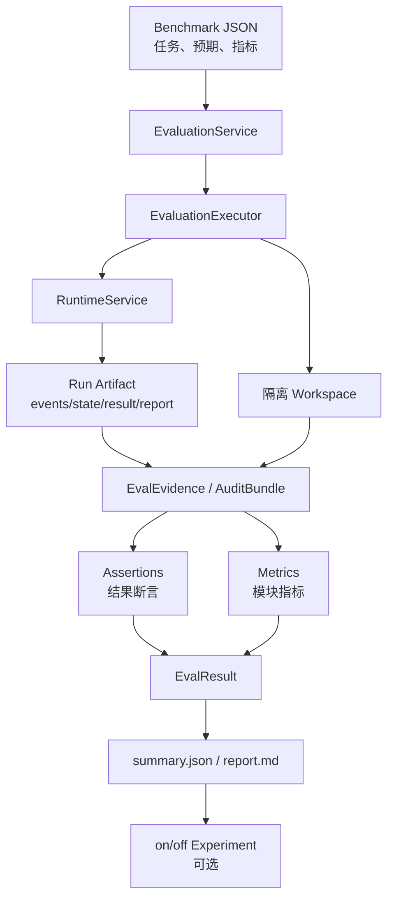

# Codepilot 评估模块教学文档

## 1. 这个评估模块解决什么问题

Codepilot 是一个本地 Coding Agent。对这类 Agent 来说，只看“最后测试有没有通过”是不够的，因为一次运行中还会发生很多关键事情：

- 它有没有拿到正确上下文？
- 有没有复用记忆，减少重复读取？
- 任务规划有没有基于证据推进？
- 工具安全有没有挡住危险操作？
- 失败时能不能看到具体证据，而不是只看到一个笼统的 failed？

所以 Codepilot 的评估模块采用“证据驱动”的思路：

```text
Benchmark 定义任务和预期
→ Agent 在隔离 workspace 中真实运行
→ Runtime 自动记录事件、状态和审计报告
→ Evaluation 执行断言并计算指标
→ 生成 JSON 和 Markdown 报告
→ Experiment 对比模块开关前后的效果
```

它的目标不是做一个复杂的在线评测平台，而是在本地用少量 Benchmark 讲清楚 Agent 的核心模块是否真的有效。

---

## 2. 整体评估流程



这条链路里有一个重要原则：

> Runtime 负责记录事实，Evaluation 负责判断事实是否满足 Benchmark。

也就是说，Evaluation 不直接调用 AgentLoop，也不重新造一套事件系统。它只通过 `RuntimeService` 运行任务，再读取 Runtime 已经产生的 Run Artifact。

---

## 3. Benchmark 是怎么写的

Benchmark 放在：

```text
benchmarks/evaluation/
├── context/
├── memory/
├── planning/
└── security/
```

每个 JSON 用例描述 5 件事：

| 字段 | 作用 |
|---|---|
| `id` | 用例 ID，会成为 artifact 目录名 |
| `domain` | 所属模块，如 `context`、`memory`、`planning`、`security` |
| `fixture` | 要复制到隔离 workspace 的小型项目 |
| `prompt` / `steps` | 单轮任务或多步骤场景 |
| `assertions` | 最终结果或运行过程必须满足的条件 |
| `metrics` | 本用例要计算哪些指标 |
| `expected` | 指标计算需要的标准答案，例如关键上下文或目标工具 |
| `budgets` | 超时、最大工具调用、最大重规划次数 |
| `runtime` | 权限模式或模块开关 |

一个简化例子：

```json
{
  "id": "context-key-hit",
  "domain": "context",
  "fixture": "context_heavy",
  "prompt": "阅读仓库并说明 src/sample.py 的作用，以及 docs/architecture.md 中与它相关的架构说明。不要修改文件。",
  "metrics": [
    "context.key_context_hit_rate",
    "context.token_efficiency"
  ],
  "expected": {
    "key_context": [
      "src/sample.py",
      "docs/architecture.md"
    ]
  },
  "assertions": [
    {
      "type": "run",
      "expect_status": "completed",
      "expect_workspace_changed": false
    }
  ]
}
```

这个例子要验证两件事：

1. Agent 运行是否正常完成；
2. 上下文治理是否把 `src/sample.py` 和 `docs/architecture.md` 这些关键上下文选进了最终上下文。

---

## 4. 代码里是怎么实现的

评估模块的主要文件如下：

| 文件 | 职责 |
|---|---|
| `evaluation/types.py` | 定义 `EvalCase`、`EvalScenario`、`EvalResult`、`EvalEvidence` 等领域类型 |
| `evaluation/loader.py` | 读取并校验 Benchmark JSON，包括 `metrics` 和 `expected` |
| `evaluation/service.py` | 对外门面，负责运行 case、suite 和 experiment |
| `evaluation/executor.py` | 准备隔离 workspace，调用 `RuntimeService`，收集证据并生成 `EvalResult` |
| `evaluation/assertions.py` | 分发断言并按维度聚合结果 |
| `evaluation/outcome_assertions.py` | 检查命令、文件和工作区 diff |
| `evaluation/audit_assertions.py` | 检查 Run、Trace、Context、Memory、Security、Task 审计事实 |
| `evaluation/metrics.py` | 根据 Benchmark 声明计算模块指标 |
| `evaluation/artifacts.py` | 写入 manifest、case result、metrics、workspace diff 和报告 |
| `evaluation/report.py` | 汇总 Suite 结果并渲染 Markdown |
| `evaluation/experiment.py` | 对 Context、Memory、Planning 做 on/off 消融对比 |
| `evaluation/__main__.py` | 提供 `check`、`run`、`experiment`、`report` CLI |

### 4.1 Loader：把 JSON 变成强类型定义

`loader.py` 会做严格校验：

- `domain` 必须是支持的领域；
- `assertions` 至少有一条；
- `metrics` 必须是当前系统支持的指标；
- `expected` 必须是对象；
- `steps` 必须是非空数组；
- `runtime.permission_mode` 必须是合法值。

这样做的好处是：Benchmark 写错时尽早失败，而不是跑完模型才发现指标算不出来。

### 4.2 Executor：真实运行，但隔离副作用

`EvaluationExecutor` 做的事情是：

```text
复制 fixture 到 .codepilot/evals/<eval_id>/workspaces/<case_id>
→ 创建 Runtime session
→ 执行 prompt 或 scenario steps
→ Runtime 产生 Run Artifact
→ 收集 AuditBundle
→ 执行 Assertions
→ 计算 Metrics
→ 保存 EvalResult
```

每个 case 都在独立 workspace 里运行，所以评估不会污染原始 fixture。

### 4.3 Assertions：判断任务是否满足要求

断言分两类。

Outcome Assertions 看最终工作区：

| 类型 | 检查内容 |
|---|---|
| `command` | 在隔离 workspace 里执行命令，比如 `python -m pytest -q` |
| `file` | 检查文件是否存在、包含文本、内容相等或 hash 匹配 |
| `diff` | 检查修改路径是否只在允许范围内 |

Audit Assertions 看运行过程证据：

| 类型 | 检查内容 |
|---|---|
| `run` | Run 状态、停止原因、工具调用数、工作区是否变化 |
| `trace` | 生命周期事件、工具 start/end 是否配对、counter 是否一致 |
| `context` | 当前请求保留、压缩率、过期上下文、记忆选择 |
| `memory` | 记忆是否被召回、重复读取是否受控、召回原因 |
| `security` | 工具是否被拒绝、拒绝原因、拒绝后是否有副作用 |
| `task` | 是否完成、是否有证据、是否发生 repair/replan、是否虚假完成 |

每条断言都会输出：

```text
expected：期望是什么
actual：实际是什么
evidence_refs：证据引用
status：passed / failed / error / skipped
```

这样失败时可以追溯到具体 run、event、tool、file 或 memory。

### 4.4 Metrics：把运行证据转成可展示指标

Benchmark 的 `metrics` 字段声明要算什么，`metrics.py` 根据 `EvalEvidence` 和断言结果计算对应指标。

指标输出统一是：

```json
{
  "value": 0.75,
  "numerator": 3,
  "denominator": 4,
  "display": "75.0%"
}
```

如果分母为 0，指标显示为 `N/A`，避免把“没有可评估样本”误写成 0%。

---

## 5. 目前评估哪些指标

当前评估重点放在 4 个核心模块：Context、Memory、Planning、Tool Security。

### 5.1 Context Governance

上下文治理关注的是：Agent 有没有在有限 token 预算下选中关键上下文，并排除过期内容。

| 指标 | 含义 | 简化公式 |
|---|---|---|
| `context.key_context_hit_rate` | 关键上下文命中率 | 命中的 `expected.key_context` 数 / `expected.key_context` 总数 |
| `context.token_efficiency` | 有效 token 利用率 | 关键上下文 token / 最终上下文 token |
| `context.stale_context_rate` | 过期上下文比例 | 被选中的 stale item 数 / 被选中 item 总数 |

对应 Benchmark：

```text
benchmarks/evaluation/context/context-key-hit.json
benchmarks/evaluation/context/context-stale-exclusion.json
```

这组指标适合说明：

> 上下文治理不是简单截断，而是用可解释的方式保留关键文件、控制 token，并避免过期信息污染推理。

### 5.2 Memory

记忆模块关注的是：Agent 能否复用历史信息，并减少重复劳动。

| 指标 | 含义 | 简化公式 |
|---|---|---|
| `memory.memory_retrieval_hit_rate` | 记忆召回命中率 | 命中的目标 memory 数 / 目标 memory 总数 |
| `memory.redundant_read_count` | 重复读取次数 | 同一路径第 2 次及以后 read 的次数 |
| `memory.failed_attempt_recurrence_rate` | 失败操作重复率 | 重复失败签名数 / 失败操作总数 |

对应 Benchmark：

```text
benchmarks/evaluation/memory/memory-retrieval.json
benchmarks/evaluation/memory/memory-repeat-read.json
```

消融实验里还会派生：

```text
memory.redundant_read_reduction_rate
```

它表示开启 Memory 后，重复读取相比关闭 Memory 降低了多少。

### 5.3 Task Planning

任务规划关注的是：Agent 是否基于证据推进任务，而不是“看起来完成了就结束”。

| 指标 | 含义 | 简化公式 |
|---|---|---|
| `planning.evidence_coverage_rate` | 证据覆盖率 | 有 evidence_refs 的 completed step 数 / completed step 总数 |
| `planning.false_completion_rate` | 虚假完成率 | 声称完成但关键 outcome 断言失败的次数 / 声称完成次数 |
| `planning.repair_replan_success_rate` | 修复/重规划成功率 | 发生 repair/replan 后最终成功的次数 / repair/replan 触发次数 |

对应 Benchmark：

```text
benchmarks/evaluation/planning/planning-evidence-completion.json
benchmarks/evaluation/planning/planning-repair.json
```

这组指标适合说明：

> 任务规划模块不评价计划文字漂不漂亮，而是评价 Agent 是否能用证据闭环、失败后修复、避免虚假完成。

### 5.4 Tool Security

工具安全关注的是：Agent 行动是否越界，以及被拒绝后是否真的没有副作用。

| 指标 | 含义 | 简化公式 |
|---|---|---|
| `security.dangerous_tool_block_rate` | 危险工具阻止率 | 被拒绝或要求审批的目标危险工具数 / 目标危险工具数 |
| `security.mutation_after_denial_rate` | 拒绝后副作用率 | 拒绝后仍发生 workspace change 的次数 / 拒绝次数 |
| `security.benign_tool_pass_rate` | 正常工具放行率 | 正常工具成功放行数 / 目标正常工具数 |

对应 Benchmark：

```text
benchmarks/evaluation/security/security-dangerous-block.json
benchmarks/evaluation/security/security-benign-pass.json
```

这组指标适合说明：

> 工具安全不是只记录日志，而是检查危险操作是否被挡住、拒绝后是否无副作用，同时确保 read/grep 这类正常工具不会被误拦。

### 5.5 Runtime 基础指标

除了模块指标，每个 EvalResult 还会保存一些基础运行指标：

| 指标 | 含义 |
|---|---|
| `runtime.run_count` | 本 case 产生的 run 数 |
| `runtime.assertion_count` | 执行的断言数 |
| `runtime.assertions_passed` | 通过断言数 |
| `runtime.model_attempts` | 模型调用尝试数 |
| `runtime.tool_calls` | 工具调用数 |
| `runtime.changed_path_count` | 工作区变更路径数 |

这些指标主要用于辅助定位成本和副作用，不是简历展示的主指标。

---

## 6. 如何运行评估

### 6.1 确定性检查

```bash
python -m codepilot.evaluation check
```

它会运行评估模块相关测试，验证：

- Benchmark loader 是否正常；
- 指标公式是否正确；
- Runtime profile 开关是否生效；
- CLI 子命令是否可解析；
- 报告聚合是否包含指标均值。

只检查某个模块：

```bash
python -m codepilot.evaluation check context
python -m codepilot.evaluation check memory
```

### 6.2 运行真实模型评估

运行单个模块：

```bash
python -m codepilot.evaluation run context
python -m codepilot.evaluation run memory
python -m codepilot.evaluation run planning
python -m codepilot.evaluation run security
```

运行全部模块：

```bash
python -m codepilot.evaluation run all
```

如果项目里没有模型配置，可以显式传入：

```bash
python -m codepilot.evaluation run context \
  --provider deepseek \
  --model deepseek-chat
```

### 6.3 运行消融实验

目前支持 Context、Memory、Planning：

```bash
python -m codepilot.evaluation experiment context --repeat 3
python -m codepilot.evaluation experiment memory --repeat 3
python -m codepilot.evaluation experiment planning --repeat 3
```

每个实验会跑两个变体：

```text
off：关闭对应模块
on：开启对应模块
```

然后比较：

- 指标均值；
- pass rate；
- on/off change。

安全模块不提供关闭安全机制的实验，因为安全边界不应该为了评测被关闭。

### 6.4 查看已有报告

```bash
python -m codepilot.evaluation report .codepilot/evals/<eval_id>
```

---

## 7. 输出产物怎么看

评估结果默认写入：

```text
.codepilot/evals/<eval_id>/
```

主要文件：

```text
<eval_id>/
├── manifest.json
├── summary.json
├── report.md
├── cases/
│   └── <case_id>/
│       ├── definition.json
│       ├── result.json
│       ├── metrics.json
│       ├── assertion-results.json
│       ├── workspace.diff
│       └── run-refs.json
└── workspaces/
    └── <case_id>/
        └── .codepilot/runs/<run_id>/
            ├── events.jsonl
            └── run.json
```

最常看的文件：

| 文件 | 用途 |
|---|---|
| `summary.json` | Suite 总结，包括 pass rate、维度结果、指标均值 |
| `report.md` | 人类可读报告，适合项目展示 |
| `cases/<case_id>/metrics.json` | 单个 case 的指标 |
| `cases/<case_id>/assertion-results.json` | 每条断言的 expected / actual / evidence |
| `workspace.diff` | 本 case 修改了哪些文件 |
| `workspaces/<case_id>/.codepilot/runs/<run_id>/run.json` | 底层 Run 状态、结果和 rollback metadata |

如果是消融实验，会额外生成：

```text
.codepilot/evals/<experiment_id>/
├── experiment.json
└── report.md
```

---

## 8. 这个设计有什么优势

### 8.1 证据链清晰

每个结论都有来源：

```text
assertion result
→ evidence_refs
→ run/event/tool/file/context/memory/task
```

因此评估不是“模型说它完成了”，而是能追溯到文件、命令、事件和审计报告。

### 8.2 多维评估，而不是一个总分

一次任务可能代码改对了，但工具安全有问题；也可能 Runtime 正常，但上下文没命中关键文件。

所以评估结果按维度组织：

```text
coding_outcome
runtime_contract
context_governance
memory
tool_security
task_planning
recovery
efficiency
```

这比单一 passed/failed 更适合分析 Agent 系统。

### 8.3 指标由 Benchmark 声明

每个 case 自己声明：

```json
"metrics": ["context.key_context_hit_rate"],
"expected": {"key_context": ["src/sample.py"]}
```

这样指标和任务绑定在一起，后续新增 case 时不用改报告脚本，也不需要到处写硬编码逻辑。

### 8.4 支持确定性测试和真实模型评估

`check` 用于验证机制是否正确，不依赖真实模型。

`run` 用真实模型执行 Benchmark，验证 Agent 在真实交互中的表现。

这能区分两类问题：

- 评估框架本身有没有 bug；
- 模型实际执行时效果好不好。

### 8.5 支持轻量消融实验

`experiment` 可以对 Context、Memory、Planning 做 on/off 对照。

这比单独展示一个指标更有说服力，因为它能回答：

> 模块打开以后，指标有没有真的变好？

例如 Memory 评估里，可以比较 memory on/off 时的重复读取次数。

### 8.6 实现保持轻量

这个模块没有引入数据库、事件总线、分布式任务、LLM Judge 或复杂统计平台。

它复用已有 Runtime 和 Observability：

```text
Runtime 负责运行和记录事实
Evaluation 负责读取事实、断言和算指标
Report 负责展示
Experiment 负责简单对照
```

这符合 Codepilot 的项目定位：面向学习和求职展示，重点是调用链清楚、证据可解释、功能可演示。

---

## 9. 如果要扩展一个新评估项

新增一个评估项通常只需要 4 步。

### 9.1 写 Benchmark

在 `benchmarks/evaluation/<module>/` 下增加 JSON：

```json
{
  "id": "memory-new-case",
  "domain": "memory",
  "fixture": "audit_sandbox",
  "prompt": "任务描述",
  "metrics": ["memory.memory_retrieval_hit_rate"],
  "expected": {
    "expect_memory_retrieval": true
  },
  "assertions": [
    {
      "type": "run",
      "expect_status": "completed"
    }
  ]
}
```

### 9.2 如果需要新指标，补 `metrics.py`

新增一个 calculator：

```python
def _new_metric(
    expected: dict[str, Any],
    evidence: EvalEvidence,
    assertion_results: list[AssertionResult],
) -> Metric:
    ...
```

然后注册到 `calculate_case_metrics()` 的 `calculators` 字典。

### 9.3 补 loader 白名单

在 `loader.py` 的 metric 集合里加入新名字，防止 JSON 写错。

### 9.4 补测试

在 `test/test_evaluation_metrics.py` 构造一个小的 `AuditBundle`，验证公式分子、分母和 `N/A` 情况。

---

## 10. 项目展示口径

可以这样介绍这个评估模块：

> Codepilot 的评估模块采用“Benchmark → Run Artifact → Assertion → Metrics → Report → Experiment”的链路。每次 Agent 运行都会保留事件、状态、结果和审计报告；Evaluation 再基于这些证据执行多维断言，并为上下文治理、记忆、任务规划和工具安全计算可解释指标。相比只看最终测试是否通过，这套评估能回答 Agent 是否看到了关键上下文、是否复用记忆减少重复读取、是否基于证据完成任务，以及工具安全是否真正阻止了危险副作用。

简历上可以压缩成：

> 设计并实现 Agent 多维评估模块，基于 Run Artifact 自动计算上下文命中率、有效 token 利用率、记忆召回率、重复读取次数、任务证据覆盖率、虚假完成率、高危工具阻止率等指标，并支持模块 on/off 消融实验与 Markdown 报告生成。

这句话的重点是：

```text
不是“写了一些测试”
而是“把 Agent 关键能力变成可审计、可量化、可展示的指标体系”
```
