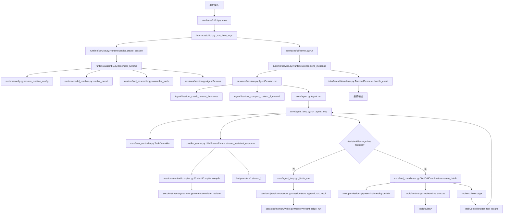

# Codepilot Agent 完整运行调用链

本文按真实调用链说明 Codepilot 从用户输入到最终输出的运行过程。它不按模块分类，而按一次 Agent Run 中实际发生的顺序展开，并用 7 个典型场景覆盖正常完成、工具调用、任务规划、失败重规划、上下文压缩、记忆复用和会话恢复。

## 总入口：从用户输入到 RuntimeService

无论后续场景如何分叉，CLI 主链都从这里开始：

1. `src/codepilot/interfaces/cli/cli.py:main`
   - 解析命令行参数。
   - 捕获用户可理解的运行时错误。
2. `src/codepilot/interfaces/cli/cli.py:_run_from_args`
   - 处理 `config` / `rpc` / 交互式 / 单次 `-p` 模式。
   - 构造 `CreateAgentSessionOptions`。
   - 创建 `RuntimeService` 并调用 `RuntimeService.create_session`。
3. `src/codepilot/runtime/service.py:RuntimeService.create_session`
   - 调用 `assemble_runtime` 完成模型、工具、上下文、提示词、钩子的装配。
   - 保存 `AgentSession` 和 `RuntimeAssembly`。
4. `src/codepilot/interfaces/cli/runner.py:run`
   - 根据运行模式把用户输入转成 `UserInput`。
   - 交互式/流式路径通常调用 `RuntimeService.send_message`。
   - 单次等待结果路径可调用 `RuntimeService.run_message`。
5. `src/codepilot/runtime/service.py:RuntimeService.send_message`
   - 校验 session 存在、输入非空、session 未忙。
   - 创建 `ActiveRun`。
   - 通过 `_stream_session_events` 订阅 `AgentSession` 事件，并把事件流转发给 CLI/Web。
6. `src/codepilot/sessions/session.py:AgentSession.run`
   - 运行 before prompt 生命周期钩子。
   - 写入任务记忆。
   - 检查上下文新鲜度。
   - 触发必要的上下文压缩。
   - 调用 `Agent.run`。
   - 持久化 RunResult、事件、记忆。

关键数据结构在入口阶段的变化：

- `CreateAgentSessionOptions`：用户/CLI 层的友好配置。
- `RuntimeAssembly`：装配后的模型、工具能力、仓库信息、诊断。
- `AgentSession`：应用级会话，负责持久化、记忆、上下文压缩和事件订阅。
- `ActiveRun`：RuntimeService 中的单次运行状态，防止同一个 session 并发运行。
- `UserInput` / `UserMessage`：用户输入在 runtime 层和 core 层的表示。

设计理念：

- 接口层只负责输入输出，不直接碰模型和工具。
- Runtime 是门面，Session 是应用级生命周期，Core 是模型-工具循环。
- 每次运行都有结构化 run id、事件和结果，便于审计与评估。

## 场景 1：正常完成（用户输入 → LLM 返回文本 → 直接完成）

### 调用链

1. `src/codepilot/runtime/service.py:RuntimeService.send_message`
2. `src/codepilot/sessions/session.py:AgentSession.run`
3. `src/codepilot/core/agent.py:Agent.run`
4. `src/codepilot/core/agent.py:Agent._start_run`
5. `src/codepilot/core/agent_loop.py:run_agent_loop`
6. `src/codepilot/core/agent_loop.py:_run_loop`
7. `src/codepilot/core/llm_runner.py:LLMStreamRunner.stream_assistant_response`
8. `src/codepilot/core/llm_runner.py:LLMStreamRunner._finalize_stream_response`
   - 或非流式模型走 `LLMStreamRunner._finalize_direct_response`
9. `src/codepilot/core/agent_loop.py:_finish_run`
10. `src/codepilot/sessions/session.py:AgentSession._on_agent_event`
11. `src/codepilot/interfaces/cli/renderer.py:TerminalRenderer.handle_event`

### 流程说明

用户输入被转换为 `UserMessage` 后，`run_agent_loop` 创建 `RunState` 并发出：

- `agent_start`
- `turn_start`
- `message_start` / `message_end`（用户消息）

随后 `LLMStreamRunner.stream_assistant_response` 组装模型上下文：

- 如启用上下文治理，先调用 `ContextCompiler.compile`。
- 调用 `convert_to_llm` 转换内部消息。
- 根据模型能力构造 `Context`。
- 调用 provider 的 `stream_simple` 或测试注入的 `stream_fn`。

如果模型只返回文本，不包含 `ToolCall`，`agent_loop` 不进入工具执行分支，直接执行完成门控。对于无工作区变更的简单问答，`TaskController.check_completion` 可以把当前步骤视为由最终回答完成，并返回 satisfied。

最终 `_finish_run` 生成 `AgentRunResult`：

- `status="completed"`
- `stop_reason="final_answer"`
- `messages=[UserMessage, AssistantMessage]`
- `final_message=AssistantMessage`

### 关键数据结构变化

- `RunState.counters.model_attempts` 增加。
- `AgentContext.messages` 追加用户消息和助手消息。
- `AgentRunResult.messages` 保存本次 run 新增消息。
- `Agent.state.messages` 在 `Agent._start_run` 成功后追加 result messages。
- `SessionStore.append_run_result` 将结果写入 `.codepilot/sessions/<id>/runs.jsonl` 和 `.codepilot/runs/<run_id>/result.json`。

### 设计理念

- 模型只负责生成语义响应。
- Core loop 负责将模型输出变成可审计的事件和结果。
- 即使没有工具调用，也仍然经过任务完成门控，避免“模型说完就算完成”的隐式判断。

## 场景 2：工具调用完成（用户输入 → LLM 返回 tool_call → 工具执行 → 结果反馈 → LLM 最终回答）

### 调用链

1. `src/codepilot/core/agent_loop.py:_run_loop`
2. `src/codepilot/core/llm_runner.py:LLMStreamRunner.stream_assistant_response`
3. `src/codepilot/core/tool_coordinator.py:ToolCallCoordinator.execute_batch`
4. `src/codepilot/core/tool_coordinator.py:ToolCallCoordinator._prepare`
5. `src/codepilot/core/tool_coordinator.py:ToolCallCoordinator._execute_prepared`
6. `src/codepilot/tools/runtime.py:ToolRuntime.execute`
7. `src/codepilot/tools/permissions.py:PermissionPolicy.decide`
8. `src/codepilot/core/tool_coordinator.py:ToolCallCoordinator._finalize`
9. `src/codepilot/core/tool_coordinator.py:ToolCallCoordinator._emit_tool_result_message`
10. `src/codepilot/core/agent_loop.py:_run_loop`
11. `src/codepilot/core/llm_runner.py:LLMStreamRunner.stream_assistant_response`
12. `src/codepilot/core/agent_loop.py:_finish_run`

### 流程说明

模型第一次返回的 `AssistantMessage.content` 中包含 `ToolCall`。`agent_loop` 提取工具调用后进入工具执行：

- `ToolCallCoordinator.execute_batch` 根据 `AgentLoopConfig.tool_execution` 选择串行或并行。
- `_prepare` 查找工具、拒绝未被 `ToolRuntime` 管理的工具，并执行 before tool hook。
- `_execute_prepared` 调用工具的 `execute`。
- 如果工具来自 `ToolRuntime.as_agent_tools`，真实执行会进入 `ToolRuntime.execute`。
- `ToolRuntime.execute` 先调用 `PermissionPolicy.decide`，再处理审批，最后执行原工具。

工具执行结束后，`ToolCallCoordinator._emit_tool_result_message` 生成 `ToolResultMessage`，并发出：

- `tool_execution_start`
- `tool_execution_update`（可选）
- `tool_execution_end`
- `message_start` / `message_end`（工具结果消息）

`agent_loop` 把 `ToolResultMessage` 加入 `current_context.messages`，再发起下一轮模型调用。第二次模型看到工具结果后返回最终文本，run 完成。

### 关键数据结构变化

- `AssistantMessage.content`：包含 `ToolCall(id, name, arguments)`。
- `ToolRuntimeRequest`：封装工具名、参数、调用 id。
- `ToolDecision`：权限策略输出 allow / deny / approval_required。
- `AgentToolResult`：工具原始结构化结果，包含 status、affected_paths、verification、metadata。
- `ToolResultMessage`：回传给模型的工具结果消息。
- `RunState.collect_tool_results`：累计工具次数、工作区变更、验证结果。

### 异常路径

- 工具不存在：`ToolCallCoordinator._prepare` 返回错误结果。
- 未管理工具：默认拒绝，原因是 `unmanaged_tool`。
- 权限拒绝：`ToolRuntime.execute` 返回 `status="denied"`。
- 需要审批：返回 `status="approval_required"`，`agent_loop` 最终返回 `waiting_approval`。
- 工具执行异常：`ToolCallCoordinator._execute_prepared` 转成结构化错误结果。
- before/after hook 异常：`ToolCallCoordinator` 转成 `before_tool_hook_error` / `after_tool_hook_error`，保证 `tool_execution_end` 和 `ToolResultMessage` 仍然发出。

### 设计理念

- 模型只能请求工具，不能给自己授权。
- 工具执行结果必须结构化，不能只是裸字符串。
- 工具事件流必须闭合，否则 pending tool 状态和审计结果都会失真。

## 场景 3：任务规划与证据绑定（TaskController 创建计划 → 多轮工具调用 → CompletionGate 验证 → 完成）

### 调用链

1. `src/codepilot/core/agent_loop.py:_run_loop`
2. `src/codepilot/core/task_controller.py:TaskController.initialize`
3. `src/codepilot/core/task_controller.py:TaskController.render_context`
4. `src/codepilot/core/task_controller.py:TaskController.control_signal`
5. `src/codepilot/core/tool_coordinator.py:ToolCallCoordinator.execute_batch`
6. `src/codepilot/core/run_state.py:RunState.collect_tool_results`
7. `src/codepilot/core/task_controller.py:TaskController.after_tool_results`
8. `src/codepilot/core/task_controller.py:TaskController.check_completion`
9. `src/codepilot/core/task_controller.py:TaskController.completion_steering`
10. `src/codepilot/core/task_controller.py:TaskController.summarize`

### 流程说明

`agent_loop` 开始时创建 `TaskController`，并用用户消息初始化 `TaskState`。默认步骤是“完成当前请求”，也可以从恢复的任务记忆中重建。

每轮模型调用前：

- `TaskController.render_context` 把当前任务状态渲染到系统提示词的 `## Current Task`。
- `TaskController.control_signal` 输出轻量信号给上下文治理和记忆检索，例如 phase、action_intent、recent_error_code。

工具执行后：

- `RunState.collect_tool_results` 记录工具调用、workspace_changed、verification。
- `TaskController.after_tool_results` 根据工具结果更新步骤状态。
- 读文件类工具通常把步骤置为 `evidence_collected`。
- 写文件类工具如果造成工作区变更，把步骤置为 `changed`，任务 phase 进入 `verifying`。
- 验证通过会调用 `_complete_verified_steps`，把步骤标记为 `completed` 和 `verified`。

完成前：

- `TaskController.check_completion` 检查是否有 blocked step。
- 检查是否有工作区变更但没有 fresh verification。
- 如果缺少验证且可以继续，会生成 `completion_steering`，要求模型运行测试或说明无法验证。

### 关键数据结构变化

- `TaskState.steps[*].status`：pending / in_progress / completed / blocked。
- `TaskState.steps[*].evidence_refs`：如 `tool:read_1`、`verification:test_1`、`file:src/app.py`。
- `TaskState.change_sets`：记录文件变更证据。
- `TaskState.completion_satisfied`：完成门控结果。
- `TaskSummary`：最终写入 `AgentRunResult.task`，也会被记忆系统使用。

### 设计理念

- 模型负责语义判断，Runtime 负责完成边界。
- 完成必须绑定证据，尤其是文件变更后必须有新鲜验证。
- 任务状态通过事件暴露，便于 CLI/Web/评估系统解释 Agent 为什么继续或停止。

## 场景 4：失败与重规划（工具执行失败 → TaskController repair/replan → 继续执行）

### 调用链

1. `src/codepilot/core/tool_coordinator.py:ToolCallCoordinator._emit_tool_result_message`
2. `src/codepilot/core/run_state.py:RunState.collect_tool_results`
3. `src/codepilot/core/task_controller.py:TaskController.after_tool_results`
4. `src/codepilot/core/task_controller.py:TaskController._has_failed_verification`
5. `src/codepilot/core/task_controller.py:TaskController._mark_latest_changes_failed`
6. `src/codepilot/core/task_controller.py:TaskController._replan_after_failure`
7. `src/codepilot/core/task_controller.py:TaskController._record_replan`
8. `src/codepilot/core/agent_loop.py:_run_loop`

### 流程说明

失败分多种：

- 普通工具错误：记录 attempt，但不一定立即重规划。
- 权限拒绝：当前步骤 blocked，决策为 `replan`。
- 工具不存在：当前步骤 blocked，决策为 `stop`。
- 验证失败：进入 repair/replan 主路径。

当 `ToolResultMessage.verification.status == "failed"`：

1. `TaskController.after_tool_results` 设置：
   - `task.action_intent="debug_failure"`
   - `task.recent_error_code="verification_failed"`
   - 当前 step `failure_count += 1`
2. 第一次失败通常返回 `ExecutionDecision(action="repair")`。
3. 同一步连续失败后：
   - 如果已有文件变更，标记 rollback required，并返回 `propose_revert`。
   - 如果没有变更且未超过重规划上限，调用 `_replan_after_failure`。
   - 如果超过上限，步骤 blocked，返回 `stop`。

### 关键数据结构变化

- `AttemptRecord`：记录本次工具尝试、工具调用 id、失败类型。
- `ChangeSet.status`：pending / failed / verified / revert_required。
- `ReplanRecord`：记录触发原因、失败 attempt、新策略、证据引用。
- `ExecutionDecision`：告诉 `agent_loop` 是继续、修复、重规划、等待审批还是停止。

### 设计理念

- 重规划不是清空历史，而是保留已完成步骤和失败证据。
- 有文件变更后的重复失败不自动乱改，而是提出可能需要回滚。
- Runtime 不猜测代码语义，只根据工具结果、验证状态、权限状态做边界控制。

## 场景 5：上下文压缩（对话过长触发 compaction → 摘要替换 → 继续对话）

### 调用链

1. `src/codepilot/sessions/session.py:AgentSession.run`
2. `src/codepilot/sessions/session.py:AgentSession._check_and_compact_before_prompt`
3. `src/codepilot/llm/overflow.py:is_context_overflow`
4. `src/codepilot/sessions/session.py:AgentSession._compact_context_if_needed`
5. `src/codepilot/sessions/session.py:AgentSession._llm_summary`
6. `src/codepilot/sessions/context/compaction.py:build_compacted_context`
7. `src/codepilot/core/agent.py:Agent.set_messages`
8. `src/codepilot/sessions/persistence/store.py:SessionStore.rewrite_context_messages`

### 流程说明

压缩有两个入口：

- 调用模型前，`_check_and_compact_before_prompt` 检查是否已经超出模型上下文窗口。
- run 完成后，`_compact_context_if_needed` 根据 `max_context_messages` 或 `max_context_tokens` 决定是否压缩。

压缩策略：

1. 保留最近 `retain_recent_messages` 条消息。
2. 将更早的消息交给 `summary_builder` 或 LLM 摘要。
3. LLM 摘要失败时使用 `fallback_summary`。
4. 用摘要消息替换旧消息。
5. 重写 agent 内存态和 context 持久化文件。

### 关键数据结构变化

- `Agent.state.messages` 被 `Agent.set_messages` 替换为压缩后的消息列表。
- `context.jsonl` 通过 `rewrite_context_messages` 重写。
- 事件日志记录 `context_compacted`，包含 before/after 数量、保留数量、估算 token、压缩原因。

### 与上下文编译的关系

压缩是长期聊天历史的粗粒度摘要；`ContextCompiler.compile` 是每次模型调用前的细粒度上下文治理。二者不是替代关系：

- compaction 解决“历史太长”。
- context compiler 解决“当前轮该给模型哪些新鲜证据”。

### 设计理念

- 历史压缩必须替换内存态和持久化态，避免恢复后又读回旧长历史。
- 压缩保留近期消息，避免刚发生的工具调用和验证结果丢失。
- 上下文编译阶段还会修复预算裁剪后的 tool_call/tool_result 配对，避免 provider 消息序列非法。

## 场景 6：记忆沉淀与复用（失败工具调用 → MemoryWriter 写入 → 下次会话 Retriever 召回 → 避免重复错误）

### 调用链

1. `src/codepilot/sessions/session.py:AgentSession._on_agent_event`
2. `src/codepilot/sessions/session.py:AgentSession._observe_tool_memory`
3. `src/codepilot/sessions/memory/writer.py:MemoryWriter.observe_tool_result`
4. `src/codepilot/sessions/memory/writer.py:MemoryWriter._remember_failure`
5. `src/codepilot/sessions/memory/writer.py:MemoryWriter._resolve_failures`
6. `src/codepilot/sessions/session.py:AgentSession._finalize_memory`
7. `src/codepilot/sessions/memory/writer.py:MemoryWriter.finalize_run`
8. `src/codepilot/sessions/context/compiler.py:ContextCompiler.compile`
9. `src/codepilot/sessions/memory/retriever.py:MemoryRetriever.retrieve`
10. `src/codepilot/sessions/memory/rendering.py:render_memory`

### 流程说明

工具结果消息落地时，`AgentSession._on_agent_event` 会监听 `message_end`。如果消息是 `ToolResultMessage`，且记忆启用，就调用 `_observe_tool_memory`。

`MemoryWriter.observe_tool_result` 的写入逻辑是证据驱动的：

- 工具修改工作区：使相关 file memory 失效。
- read 成功：记录 file 记忆，绑定 file hash。
- 工具失败且错误码在已知集合：记录 failure 记忆。
- 后续同类工具成功：调用 `_resolve_failures` 给失败记录写入 resolution。
- 验证结果存在：写入 active task 的 confirmed findings。

run 结束后，`AgentSession._finalize_memory` 调用 `MemoryWriter.finalize_run`：

- 如果有 `TaskSummary`，把完成/待办/阻塞步骤投影回 task memory。
- 如果 run 出错，把错误加入 blocked_on。
- 同时通过 `ExperienceExtractor` / `MemoryConsolidator` 沉淀经验记忆。

下一轮模型调用前，`ContextCompiler.compile` 会调用 `MemoryRetriever.retrieve`：

- 根据当前用户文本、活跃文件、任务 phase、action_intent、recent_error_code 检索。
- 过滤 stale/candidate/低价值 failure。
- 将召回结果通过 `render_memory` 注入 `## Compiled Task Context` 的 Recalled memory。

### 关键数据结构变化

- `MemoryRecord(kind="task")`：当前任务目标、进度、下一步、阻塞原因。
- `MemoryRecord(kind="file")`：文件摘要和 hash。
- `MemoryRecord(kind="failure")`：失败签名、原因、出现次数、resolution。
- `MemoryQuery`：检索输入。
- `RetrievedMemory`：检索结果、分数和召回原因。
- `ContextReport.retrieved_memory_ids`：记录本轮使用了哪些记忆。

### 设计理念

- 记忆不是聊天归档，而是证据化事实。
- 文件相关记忆必须绑定 hash，文件变化后自动 stale。
- failure 记忆要避免污染：单次失败且无 resolution 的记录默认不召回。
- 记忆召回过程进入 ContextReport，方便评估和面试讲解。

## 场景 7：会话恢复（会话中断 → 持久化 → 恢复时加载 recovered_task → 接续执行）

### 调用链

1. `src/codepilot/interfaces/cli/cli.py:_run_from_args`
2. `src/codepilot/runtime/service.py:RuntimeService.create_session`
3. `src/codepilot/runtime/assembly.py:assemble_runtime`
4. `src/codepilot/runtime/config.py:load_runtime_inputs`
5. `src/codepilot/runtime/config.py:read_restored_session_meta`
6. `src/codepilot/runtime/model_resolver.py:resolve_model`
7. `src/codepilot/sessions/session.py:AgentSession.__init__`
8. `src/codepilot/sessions/persistence/store.py:SessionStore.load_session_messages`
9. `src/codepilot/sessions/session.py:AgentSession.run`
10. `src/codepilot/sessions/session.py:AgentSession._active_task_projection`
11. `src/codepilot/core/agent.py:Agent.set_recovered_task`
12. `src/codepilot/core/task_controller.py:TaskController.initialize`
13. `src/codepilot/core/task_controller.py:TaskController._from_recovered_task`

### 流程说明

恢复由 CLI 的 `--resume` 或调用方传入 `session_id` 触发。

`RuntimeService.create_session` 会判断 `.codepilot/sessions/<session_id>/meta.json` 是否存在。`assemble_runtime` 的装配过程会：

- `load_runtime_inputs` 读取 restored meta。
- `resolve_model` 优先用恢复会话中的 provider/model_id。
- `resolve_runtime_config` 恢复 system prompt 等配置。
- 创建新的 `AgentSession`。

`AgentSession.__init__` 会：

- 初始化同一个 session store。
- 先调用 `load_session_messages` 读取消息树。
- 如果消息树为空，fallback 到 `load_context_messages`。
- 将持久化消息和 options.messages 合并后交给 `AgentOptions.messages`。

新 run 开始时：

- `AgentSession.run` 调用 `_remember_task` 写入/更新 active task。
- 然后调用 `_active_task_projection` 读取 active task memory。
- `Agent.set_recovered_task` 把投影交给 core。
- `TaskController.initialize` 如果看到 recovered_task，就调用 `_from_recovered_task` 重建步骤状态。

### 关键数据结构变化

- `meta.json`：保存 session_id、model_id、provider、system_prompt、leaf_id。
- `session.jsonl`：消息树，可分支。
- `context.jsonl`：恢复上下文消息。
- `memory.json`：session 级结构化记忆。
- `recovered_task`：从 active task memory 投影出的 goal、task_progress、next_action。
- `TaskState`：由 recovered_task 重建，已完成步骤保持 completed，pending step 变为 in_progress。

### 分支和检查点

会话历史相关调用链：

- `src/codepilot/sessions/history/branching.py:fork_session`
- `src/codepilot/sessions/persistence/store.py:SessionStore.fork_to`
- `src/codepilot/sessions/history/branching.py:switch_to_entry`
- `src/codepilot/sessions/persistence/store.py:SessionStore.set_leaf`
- `src/codepilot/sessions/history/checkpoint.py:record_checkpoint`

分支不是复制运行时全局状态，而是复制指定 leaf 路径上的消息、上下文和 session memory。

### 设计理念

- 恢复不是仅恢复聊天文本，还要恢复模型配置、系统提示词、任务进度、记忆和消息树 leaf。
- 会话树允许从历史节点 fork，方便学生演示“不同修复路线”的探索。
- recovered_task 让中断后的任务可以接续，而不是重新从零规划。

## 完整调用链总览图

## 阅读建议

如果只想讲清楚面试里的主线，可以按这个顺序读代码：

1. `src/codepilot/interfaces/cli/cli.py:_run_from_args`
2. `src/codepilot/runtime/assembly.py:assemble_runtime`
3. `src/codepilot/sessions/session.py:AgentSession.run`
4. `src/codepilot/core/agent_loop.py:_run_loop`
5. `src/codepilot/core/tool_coordinator.py:ToolCallCoordinator.execute_batch`
6. `src/codepilot/core/task_controller.py:TaskController.after_tool_results`
7. `src/codepilot/sessions/context/compiler.py:ContextCompiler.compile`
8. `src/codepilot/sessions/memory/writer.py:MemoryWriter.observe_tool_result`
9. `src/codepilot/sessions/persistence/store.py:SessionStore.load_session_messages`

